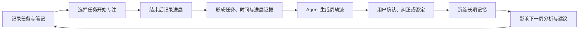
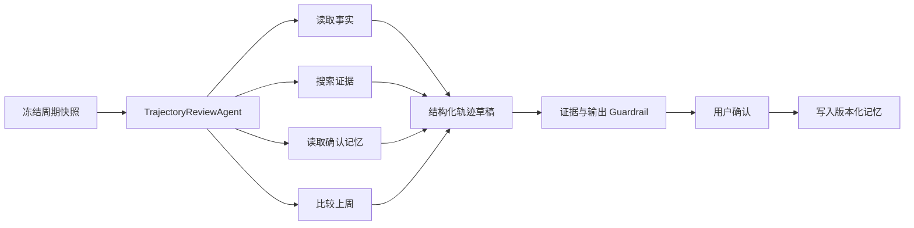

# 见时 V1 PRD：最小行动—轨迹闭环

> 产品名称：见时  
> 版本：V1 / PRD v0.1  
> 日期：2026-08-12  
> 状态：产品范围确认稿  
> 核心范围：任务组织、专注与进展、轨迹与长期记忆

## 1. 产品定义

见时是一款从真实行动中帮助用户看见方向的个人时间管理工具。

用户不需要先搭建年目标、月计划和周计划，也不需要持续维护任务与目标之间的关系。用户只需要：

1. 用文件夹、清单和分组组织任务与笔记；
2. 围绕任务进行番茄或正计时，并留下最少量的进展记录；
3. 定期查看 Agent 根据真实行动生成的轨迹，确认或纠正它的理解。

随着用户不断确认和纠正，系统逐渐形成对用户方向的长期记忆，并用这些认识改善之后的分析。

### 1.1 一句话承诺

> 你只管踏实做，见时帮你从行动中看见方向。

### 1.2 最小闭环



V1 是否成立，只看这条闭环能否持续发生。其他功能都不能以破坏它的简洁性为代价。

## 2. 背景与问题

传统任务工具已经很好地解决了“我要做什么”和“如何组织任务”，但用户仍然需要自己完成三项高成本工作：

- 回忆一周做过什么；
- 判断哪些投入真正推动了重要方向；
- 把零散行动重新整理成周、月和年度认识。

手工维护“任务 → 周计划 → 月计划 → 年计划”的关系成本过高，现实变化后也很容易失真。结果是用户可以长期记录任务，却很难从这些记录中获得方向感。

见时的核心假设是：如果系统能够持续记录任务状态、专注时间和进展信号，Agent 就可以先提出有证据的方向判断；用户只做轻量确认，便能逐步形成可靠的长期认识。

## 3. 目标与非目标

### 3.1 V1 产品目标

- 用户能在不学习新方法论的情况下完成任务组织；
- 用户能在两次操作内围绕任务开始计时；
- 一次专注结束后的反馈可在 15 秒内完成；
- 使用一周后，系统能生成第一份有证据的周轨迹；
- 用户能在 3 分钟内确认或纠正周轨迹；
- 用户的纠正会在后续分析中被正确继承；
- 用户能更清楚地回答“这一周主要在推进什么、时间花到了哪里”。

### 3.2 V1 非目标

V1 不包含：

- 日历及日/周/月/年日历视图；
- 标签、复杂过滤器和四象限；
- 看板、时间线和甘特能力；
- 提醒、复杂重复任务、农历和法定工作日规则；
- 习惯打卡和倒数纪念日；
- 团队共享、指派、评论和权限体系；
- 附件、邮箱/微信/浏览器插件等多入口捕获；
- 自动排期、自动修改任务或自动创建长期目标；
- 独立的月复盘、年复盘页面；
- 多 Agent 协作展示。

底层设计不得阻止上述能力后续加入，但 V1 不以实现它们为验收条件。

## 4. 目标用户与核心场景

### 4.1 目标用户

V1 面向同时推进工作和个人成长事项的个人知识工作者：

- 已有记录任务的习惯；
- 愿意通过正计时或番茄了解投入；
- 经常感觉“每天很忙，但不知道长期有没有前进”；
- 想做周复盘，却难以持续手工整理；
- 暂时不需要复杂团队项目管理。

### 4.2 核心使用场景

1. 想到一件事，立即放入收集箱；
2. 整理时把任务移动到对应文件夹、清单或分组；
3. 开始工作前选择任务，启动番茄或正计时；
4. 结束后标记“完成、有推进、被阻塞、维持事务”，可补充一句进展；
5. 周末查看 Agent 生成的事实与方向判断；
6. 对判断执行确认、改正、否定或排除学习；
7. 从下周开始，Agent 自动继承这些认识。

## 5. 信息架构

V1 只有三个一级模块：

1. **任务**：文件夹、清单、分组、任务、子任务和笔记；
2. **专注**：番茄、正计时、专注记录；
3. **轨迹**：周事实、方向判断、用户确认和长期记忆。

桌面端沿用低干扰的多栏结构：

- 左侧窄栏：任务、专注、轨迹；
- 任务模块第二栏：收集箱、文件夹和清单；
- 中间主栏：分组与任务/笔记列表；
- 右侧详情栏：任务、笔记、进展或轨迹证据详情。

移动端将多栏拆分为逐级页面，保持同一信息架构。

## 6. 模块一：任务组织

### 6.1 对象层级

```text
文件夹（可选）
└── 清单
    └── 分组（可选）
        ├── 任务
        │   └── 子任务
        └── 笔记
```

规则：

- 收集箱是系统默认清单，不能删除；
- 文件夹只用于聚合同类清单，不直接包含任务；
- 清单是任务和笔记的稳定主归属；
- 分组是清单内部的可选区段；未设置分组的内容进入“未分组”；
- V1 UI 支持一层子任务；数据模型使用 `parent_task_id`，为后续扩展保留空间；
- 任务和笔记可以在同一清单、同一分组中混排。

### 6.2 任务

任务字段：

| 字段 | 要求 |
|---|---|
| 标题 | 必填，创建任务时唯一必填字段 |
| 状态 | 待办、完成、放弃 |
| 所属清单 | 必填，默认收集箱 |
| 所属分组 | 可选 |
| 父任务 | 可选，仅子任务使用 |
| 计划日期 | 可选，V1 只支持日期，不提供日历视图 |
| 优先级 | 可选：高、中、低、无 |
| 正文 | 可选，使用统一块内容模型 |
| 创建/修改时间 | 系统记录 |
| 排序值 | 系统记录，支持拖动排序 |

任务操作：

- 快速创建；
- 编辑标题和正文；
- 设置清单、分组、计划日期和优先级；
- 新建、编辑和完成子任务；
- 移动、拖动排序；
- 完成、取消完成、放弃；
- 查看累计专注时间、最近进展和动态；
- 从任务详情直接开始专注。

### 6.3 笔记与检查事项合一

V1 不设置独立的“检查事项任务类型”。正文统一使用块内容模型：

- 段落；
- 无序列表；
- 有序列表；
- 检查项；
- 分隔线。

“笔记”是一种不需要完成状态的内容项；“任务正文”与独立笔记复用同一套块编辑器。用户可以在任务正文或独立笔记中自由插入检查项。

这样可以避免“这段内容应该建成笔记、检查清单还是任务描述”的额外判断。

笔记字段：

- 标题；
- 所属清单与分组；
- 块内容；
- 创建/修改时间；
- 排序值。

V1 不支持笔记附件、协作评论、模板和双向链接。

### 6.4 快速添加

默认流程：

1. 在任务列表顶部输入标题；
2. 按 Enter 创建到当前清单/分组；
3. 在收集箱外创建时，自动继承当前上下文；
4. 用户可以在创建前快捷设置类型、日期、优先级和清单；
5. Agent 不在创建时追问方向或目标归属。

性能要求：

- 创建后立即乐观展示；
- 普通网络下 500ms 内得到服务端确认；
- 失败时保留用户输入并提供重试；
- 连续快速创建不会丢失或重复任务。

### 6.5 任务动态

系统自动记录：

- 创建；
- 标题或正文修改；
- 移动清单/分组；
- 设置或修改计划日期；
- 优先级变化；
- 完成、重开、放弃；
- 新增、完成或删除子任务；
- 开始、暂停和结束专注；
- 用户新增进展记录。

动态以时间线呈现。任务当前状态可以修改，历史事件不可被静默重写。

### 6.6 模块验收标准

- 用户可创建文件夹、清单和分组，并完成重命名、排序和归档；
- 用户可在收集箱或任意清单内连续快速创建任务；
- 用户可创建一层子任务和独立笔记；
- 任务正文与笔记都能混排文本和检查项；
- 完成任务后，它进入当前分组下的已完成折叠区；
- 放弃与完成在数据和界面上明确区分；
- 任一任务可以看到完整动态、累计专注和最近进展。

## 7. 模块二：番茄、正计时、进展与动态

### 7.1 专注模式

V1 提供两种模式：

#### 番茄倒计时

- 默认 25 分钟；
- 提供 15、25、50、90 分钟快捷值；
- 支持用户输入自定义时长；
- 倒计时结束后提示用户结束或继续额外时间；
- V1 不实现自动番茄组、长休息和成就系统。

#### 正计时

- 从 00:00 开始累计；
- 适合时长不确定、持续投入的任务；
- 支持暂停、继续和结束；
- 单次记录默认最长 12 小时，超过时要求用户确认。

### 7.2 关联对象

- 开始前推荐选择一项任务或子任务；
- 用户可以选择“暂不关联”，不能因为没有任务而阻止计时；
- 笔记不能作为专注目标；
- 专注结束后可以补选或更改关联任务；
- 一次专注只能直接关联一个任务，Agent 可在之后推断其对多个方向的贡献。

### 7.3 运行状态

计时状态包括：

- 未开始；
- 运行中；
- 已暂停；
- 已结束；
- 已取消。

要求：

- 刷新页面后能恢复正在进行的计时；
- 浏览器后台运行时不依赖前端每秒累加，显示值由时间戳计算；
- 同一用户同一时刻只能有一个运行中的专注；
- 关闭页面后重新进入，能够继续或结束当前专注；
- 用户可以修正错误的开始时间、结束时间和最终时长；
- 修改后的记录保留调整前值和调整原因。

### 7.4 专注结束反馈

结束时弹出轻量反馈，默认只要求选择一个结果：

- **完成**：任务或明确阶段已经完成；
- **有推进**：取得了可描述的进展，但任务未完成；
- **被阻塞**：投入了时间，但因为某个原因无法继续；
- **维持事务**：完成了必要工作，但不代表重要方向取得推进。

可选字段：

- 一句话进展；
- 下一步；
- 是否完成任务；
- 调整实际时长。

交互要求：

- 只选择结果即可保存；
- 默认操作在 15 秒内完成；
- 用户可以稍后补充；
- 不强制填写百分比；
- 如果用户选择“完成”，需要明确询问是否同时完成关联任务。

### 7.5 手工进展记录

用户可以不经过计时，直接在任务详情新增进展：

- 有推进；
- 被阻塞；
- 维持事务；
- 备注。

进展记录包含正文、创建时间、关联任务和可选下一步。记录创建后进入任务动态，并成为轨迹证据。

### 7.6 专注记录页

展示：

- 当前计时器；
- 今日专注总时长；
- 今日番茄数；
- 最近专注记录；
- 每条记录的时间段、时长、关联任务和结果；
- 编辑或删除错误记录入口。

V1 不提供复杂趋势图、年度热力图和排行榜；这些统计先由轨迹中的周期事实承担。

### 7.7 模块验收标准

- 用户能从专注页或任务详情启动番茄/正计时；
- 计时刷新后准确恢复，误差不超过 2 秒；
- 暂停时间不计入有效专注时长；
- 结束反馈能够生成结构化进展事件；
- 手工修正会保存审计信息；
- 任务详情能正确汇总多次专注时长；
- 未关联专注不会丢失，之后可以重新关联；
- Agent 可以通过授权工具读取周期内专注与进展事实。

## 8. 模块三：见时·轨迹

### 8.1 V1 的轨迹周期

V1 以“周”为唯一正式复盘周期：

- 默认周期为周一 00:00 至周日 23:59；
- 按用户时区计算；
- 用户可手动生成当前周草稿；
- 周期结束后系统自动生成一次；
- 支持查看历史周轨迹；
- V1 不生成独立月复盘和年复盘，但确认记忆会跨周累计，为后续长周期归纳准备数据。

采用周作为最小周期，是因为一天的数据容易被偶发事件误导，而一周通常足以形成可讨论的投入结构。

### 8.2 轨迹页面结构

每份周轨迹包含四部分：

#### A. 事实镜子

只呈现可复现事实：

- 总专注时长、有效会话数和番茄数；
- 完成、推进、阻塞、维持事务的任务数量；
- 各清单的时间分布；
- 计划日期在本周但未完成的任务；
- 与上周相比最明显的变化；
- 数据缺口，例如大量未关联专注。

事实由数据库查询生成，不由模型自由计算。

#### B. Agent 解释

最多展示 3–5 张判断卡，每张包含：

- 判断文本；
- 类型：方向、进展、偏差、阻塞、模式；
- 置信度：高、中、低；
- 简短理由；
- 证据引用；
- 用户反馈操作。

示例：

> 你本周似乎主要在推进“时间管理产品验证”。相关的 4 个任务产生了 6 次有效专注，共 4 小时 12 分，其中 3 次被标记为“有推进”。

#### C. 用户校正

用户可以对判断执行：

- 准确；
- 方向名称不对；
- 关联错了；
- 这是维持事务；
- 这是探索，暂不形成方向；
- 不要再从这类内容学习；
- 这条判断完全错误。

操作结果必须说明会如何影响未来。例如：“以后此清单默认视为维持事务，仍可在单条任务中覆盖。”

#### D. 下一周选择

Agent 根据本周事实和已确认方向，最多提出 3 个下周重点。用户可以：

- 保留；
- 改写；
- 暂停；
- 删除；
- 新增自己的重点。

重点不是传统目标树，只是下周的确认承诺。确认后显示在下一周轨迹顶部，并在任务模块提供一个轻量提示，不要求用户为每个新任务手工关联。

### 8.3 证据抽屉

点击任意 Agent 判断，可查看：

- 被引用的任务与子任务；
- 相关专注记录；
- 相关进展文字；
- 时间汇总；
- 与上一周期的比较；
- Agent 为什么将它们归入同一方向。

用户可以从证据层直接移除错误关联。移除动作会进入长期记忆候选。

### 8.4 长期记忆

V1 长期记忆包含：

| 类型 | 示例 |
|---|---|
| 已确认方向 | 时间管理产品验证 |
| 贡献映射 | 某清单/某类任务通常支持某方向 |
| 分类规则 | 周报整理通常属于维持事务 |
| 用户偏好 | 不用完成任务数量评价效率 |
| 排除规则 | 私人清单不参与分析 |
| 方向状态 | 活跃、暂停、结束、被替代 |

记忆规则：

- Agent 只能创建候选记忆；
- 用户明确确认后才进入长期记忆；
- 每条记忆包含来源证据、确认时间和版本；
- 用户可以查看、编辑、停用或删除；
- 新记忆可以替代旧记忆，但不能静默重写历史；
- 删除原始数据时，应标记并重新评估依赖该证据的记忆；
- SDK Session、聊天上下文和长期记忆必须分开存储。

### 8.5 Agent SDK 工作流

V1 使用开源 TypeScript `@openai/agents`，运行一个 `TrajectoryReviewAgent`。



Agent 工具：

- `get_period_snapshot(period_id)`；
- `search_evidence(period_id, query, scope)`；
- `get_confirmed_memories(user_id)`；
- `compare_periods(current_id, previous_id)`；
- `propose_contribution_edges(evidence_ids, direction)`；
- `validate_review_evidence(review_draft)`。

要求：

- 输出必须符合固定 JSON Schema；
- 每条非事实判断至少引用一条有效证据；
- 数字与事实必须通过 Guardrail 校验；
- 未通过校验的判断不得展示；
- Agent 不得直接修改任务、方向或长期记忆；
- 每次运行保存模型、提示词版本、工具调用、输入哈希、输出、耗时和成本；
- 支持失败重试和相同输入的幂等生成；
- 为后续拆分 Evidence、Direction、Planning Agent 保留接口，但 V1 不启用多 Agent。

### 8.6 生成状态

轨迹状态：

- 等待数据；
- 生成中；
- 待确认；
- 已确认；
- 已部分确认；
- 生成失败；
- 已被新版本替代。

当有效数据不足时，应展示“还在了解你”并说明缺少什么，不生成空洞结论。

建议的最低生成条件：

- 周期内至少存在 3 次有效专注；或
- 至少存在 3 条完成/推进/阻塞进展事件。

用户仍可强制生成，但页面需要明确标记低数据量。

### 8.7 模块验收标准

- 周期事实能够从原始事件重复计算并得到一致结果；
- Agent 每条判断都可展开查看证据；
- 数字错误、无效 evidence ID 会被 Guardrail 拦截；
- 用户能在不超过 3 分钟内完成一份典型周轨迹确认；
- 用户纠正后，下周同类判断能够继承该规则；
- 用户删除或停用记忆后，后续运行不再使用它；
- Agent 无法在未经用户确认时写入长期记忆；
- 生成失败不影响任务和专注功能使用。

## 9. 跨模块核心流程

### 9.1 第一次使用

1. 用户进入任务模块；
2. 系统展示收集箱和示例引导；
3. 用户创建第一个任务；
4. 系统提示可以围绕该任务开始专注；
5. 用户结束专注并选择结果；
6. 系统提示“这些记录将在周轨迹中帮助你看见方向”。

不要求用户在 onboarding 中创建目标、人生领域或完整清单系统。

### 9.2 日常执行

1. 快速创建或选择任务；
2. 开始专注；
3. 结束并标记结果；
4. 继续下一项任务。

Agent 在日常执行流程中保持安静，不弹出方向判断。

### 9.3 周闭环

1. 系统生成周事实快照；
2. Agent 生成轨迹草稿；
3. 用户先看事实，再处理 3–5 张判断卡；
4. 用户确认 1–3 个下周重点；
5. 系统保存轨迹版本和确认记忆；
6. 下一周分析继承这些确认。

## 10. 概念数据模型

### 10.1 用户内容

- `folders`
- `lists`
- `groups`
- `tasks`
- `content_items`
- `content_blocks`

其中 `tasks.parent_task_id` 表达子任务；`content_items.kind` 区分任务和独立笔记；正文统一由 `content_blocks` 表达。

### 10.2 行为证据

- `task_events`
- `focus_sessions`
- `focus_adjustments`
- `progress_entries`
- `period_snapshots`

原始行为事件采用追加写入，任务当前状态是事件的查询投影。

### 10.3 Agent 与轨迹

- `agent_runs`
- `review_versions`
- `review_claims`
- `evidence_refs`
- `directions`
- `contribution_edges`
- `memory_candidates`
- `confirmed_memories`
- `next_period_commitments`

所有 Agent 生成对象必须记录来源 run、模型和提示词版本。

## 11. 权限、隐私与可信度

- 用户可以关闭整个 Agent 分析；
- 用户可以把某个清单设置为“不参与学习”；
- 被排除内容不进入模型上下文、向量索引和轨迹统计；
- 轨迹页面明确区分“事实、Agent 推断、用户确认”；
- 模型供应商密钥只存在于服务端；
- 日志默认不记录完整敏感正文；
- 用户可导出任务、专注、轨迹和长期记忆；
- 删除账号时删除原始内容、派生证据、向量和长期记忆；
- Agent 对心理、健康、职业等方向只能提出可能性，不做权威诊断。

## 12. 非功能要求

### 12.1 性能

- 任务列表首屏可交互时间目标小于 1.5 秒；
- 快速创建本地反馈小于 100ms；
- 任务状态切换本地反馈小于 100ms；
- 轨迹生成允许异步执行，目标 60 秒内完成；
- 生成期间不阻塞任务和专注操作。

### 12.2 可靠性

- 所有写操作有幂等键；
- 正在运行的计时以服务端时间戳为事实源；
- 轨迹生成失败可以重试，不产生重复版本；
- 周期快照一旦用于生成便不可静默修改；
- 用户修改历史数据后，可以显式重新生成新版本。

### 12.3 可观测性

- 记录任务写入失败率；
- 记录计时恢复和时长修正率；
- 记录 Agent 工具错误、Guardrail 拦截和生成失败；
- 记录模型用量、延迟和单份轨迹成本；
- 记录判断卡的接受、修改、否定与证据展开行为。

## 13. 成功指标

### 13.1 北极星指标

**完成行动—学习闭环的有效周数。**

有效周需要同时满足：

- 至少 3 次有效专注或进展记录；
- 用户查看了周轨迹；
- 用户至少确认或纠正了一条 Agent 判断；
- 用户确认了至少一个下周重点；
- 下一周该重点产生至少一次推进证据。

### 13.2 核心指标

- 新用户首日创建任务率；
- 有任务关联的专注比例；
- 专注结束反馈完成率；
- 周轨迹触达、打开和确认率；
- 周轨迹确认中位时长；
- 判断卡接受、修改、否定比例；
- 同类判断重复犯错率；
- 第四周仍完成闭环的用户比例；
- 用户自评方向清晰度变化。

### 13.3 反指标

- 用户为了统计好看而过度计时；
- Agent 报告越来越长但确认率下降；
- 用户因为被评价而减少真实记录；
- 接受率高但证据展开和后续行动没有发生；
- Agent 把时间占比最高的事务直接定义为人生方向。

## 14. 交付阶段

### 阶段 A：任务内核

- 文件夹、清单、分组；
- 任务、子任务、独立笔记；
- 统一块编辑器；
- 快速添加、完成/放弃、排序；
- 任务动态基础事件。

### 阶段 B：执行证据

- 番茄和正计时；
- 任务关联；
- 暂停、恢复、修正；
- 结束反馈；
- 手工进展和任务动态；
- 周期事实快照。

### 阶段 C：轨迹闭环

- `TrajectoryReviewAgent`；
- 事实镜子、判断卡和证据抽屉；
- 用户校正；
- 下周重点；
- 候选记忆与确认记忆；
- 历史周轨迹与版本。

三个阶段全部完成后才称为 V1。阶段 A 或 B 可以内部试用，但不能验证产品的核心价值。

## 15. 发布门槛

V1 进入小范围真实用户测试前必须满足：

- 核心数据对象和事件模型通过迁移测试；
- 连续计时、刷新恢复和手工修正通过端到端测试；
- 周期边界、时区和跨周会话有明确处理规则；
- Agent 输出 Schema、证据校验和无证据拒绝通过评测；
- 至少准备 30 份匿名或合成周数据作为 Agent 回归评测集；
- 用户可以关闭学习、排除清单、查看与删除记忆；
- 完成至少一轮内部连续两周闭环测试；
- 任务与专注在 Agent 服务不可用时仍可正常工作。

## 16. 待确认但不阻塞原型的问题

以下问题可在可用性测试中决策，当前采用推荐默认值：

| 问题 | V1 默认 |
|---|---|
| 未关联任务能否开始专注 | 可以，但结束时提示补关联 |
| 周起始日 | 周一，跟随用户时区 |
| 子任务层数 | UI 一层，数据模型可扩展 |
| 是否展示任务进度百分比 | 默认不展示，使用进展事件 |
| Agent 判断数量 | 每周最多 5 条 |
| 下周重点数量 | 最多 3 条 |
| 记忆是否自动写入 | 否，必须用户确认 |
| 是否自动完成任务 | 否，需要用户明确选择 |
| 是否允许重新生成轨迹 | 允许，产生新版本，不覆盖旧版本 |

## 17. V1 完成定义

当一位新用户能够在没有人工指导的情况下完成以下全过程，V1 才算完成：

1. 建立或选择清单；
2. 创建任务并围绕它完成数次专注；
3. 留下至少一次推进或阻塞记录；
4. 在周末看到由这些事实生成的轨迹；
5. 理解每项判断为什么产生；
6. 纠正至少一项 Agent 理解；
7. 确认下一周重点；
8. 在下一周看到 Agent 正确继承上次纠正。

这时产品才真正实现了“用户踏实做，Agent 帮用户找到方向”的最小闭环。
