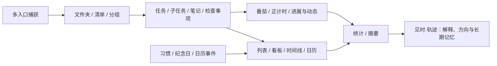
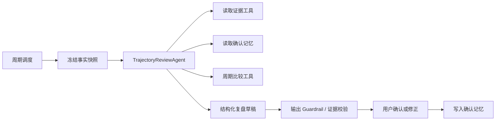

# 滴答清单产品拆解与复用地图

> 版本：v0.1  
> 日期：2026-08-12  
> 研究方法：Web 端只读实机审计、滴答清单 MCP 领域对象核对、官方功能页/帮助中心/更新日志交叉验证  
> 目标：识别已经被市场验证、可直接继承的任务与时间管理范式，并明确“见时·轨迹”真正需要创新的部分

## 1. 结论

滴答清单不是“任务表 + 番茄钟”，而是一套由统一领域对象驱动的多视图系统：

见时不应重新发明捕获、组织、任务详情、计时和基础统计。创新边界应收缩到：

- 自动把跨清单、跨任务的行为聚合成阶段主题；
- 区分事实、Agent 推断和用户承诺；
- 解释任务/专注对方向的贡献，并展示证据；
- 记住用户的纠正，逐周、逐月、逐年形成方向演化；
- 把复盘结论带回下一周期行动，而不是只导出一篇周报。

## 2. 滴答清单的信息架构

### 2.1 一级功能模块

Web 端使用约 48px 的常驻窄导航栏切换任务、日历、专注、习惯、搜索、倒数纪念日等模块。模块可以独立占满主工作区，避免把所有能力塞进任务页。

复用决定：见时沿用一级模块导航，但把“轨迹”放在核心位置；倒数日、习惯等低频模块可进入更多菜单或后续开放。

### 2.2 任务模块

任务模块采用成熟的三栏结构：

1. 清单导航：智能清单、文件夹、清单、过滤器、标签、完成/放弃/垃圾桶；
2. 任务列表：快速添加、排序/分组、未完成与已完成折叠；
3. 任务详情：完成、日期、优先级、标题、内容/检查事项、清单、格式、评论、更多动作。

当没有选择任务时，第三栏保持安静；选择任务后原地展开详情，不打断列表上下文。

复用决定：桌面端直接采用这一布局范式。移动端把三栏拆成导航页、列表页、详情页，并保留返回位置。

### 2.3 日历、专注、习惯

- 日历模块会收起清单导航，把空间让给时间轴和多视图切换；
- 专注模块使用“大计时器 + 概览/专注记录”双栏结构；
- 习惯模块先展示七日打卡条和习惯列表，选择后在右栏展示月统计、月历和打卡日志；
- 倒数纪念日使用横向卡片，不与任务列表强行合并。

这说明成熟产品会根据核心动作改变工作区，而不是强求所有模块共享一种页面模板。

## 3. 领域对象与关系

滴答帮助中心给出的组织层级是“文件夹 → 清单 → 分组 → 任务 → 子任务”；实机与 MCP 进一步证明，标签、过滤器和智能清单是独立的横向组织方式。[常见问题](https://help.dida365.com/articles/6950670128287580160)

### 3.1 清单与分组

清单至少包含：

- 名称、颜色、排序；
- 类型：任务清单或笔记清单；
- 视图模式：列表、看板、时间线；
- 所属文件夹；
- 归档状态；
- 共享权限。

分组属于清单，是看板列或列表中的自定义分区。看板并不是另一套项目对象，而是清单的显示模式。[看板视图](https://help.dida365.com/articles/6950656501543337984)

### 3.2 任务

任务至少需要兼容：

- 状态：进行中、完成、放弃；
- 类型：文本、笔记、检查事项；
- 标题、正文、检查项；
- 开始时间、截止时间、全天、时区；
- 单日/跨日时间段；
- 优先级；
- 提醒、重复规则；
- 清单、分组、父任务、标签；
- 负责人、评论、附件；
- 排序值、版本/ETag；
- 创建、编辑、移动、完成等任务动态。

子任务不是弱化的检查项。官方说明其在日期、专注、详情、标签、优先级和指派等方面与普通任务基本一致，最多可形成五级层次。[多级任务](https://help.dida365.com/articles/6950660746367729664)

### 3.3 习惯

习惯应独立建模，至少包含：

- 布尔型或计量型；
- 目标值、步长、单位；
- 重复规则和排除日期；
- 提醒；
- 早晨/下午/夜间或自定义分区；
- 图标、颜色、鼓励语；
- 独立打卡记录、补记、备注、连续天数和统计。

任务适合“完成一个结果”，习惯适合“重复发生一种行为”。二者都能贡献轨迹证据，但不能共享同一状态机。

### 3.4 专注

专注记录至少包含：

- 模式：番茄倒计时或正计时；
- 开始、结束、暂停、调整后时长；
- 关联任务或习惯；
- 备注；
- 是否补记；
- 多端同步状态。

滴答支持在开始前关联具体任务、结束后调整时长、补记历史记录，并按年/月/周、时间段、清单、标签和任务统计投入。[如何开始专注](https://help.dida365.com/articles/6950408124297641984)、[专注数据统计](https://help.dida365.com/articles/6950408300395495424)

## 4. 核心交互拆解

### 4.1 快速捕获

成熟模式是“标题先行、属性渐进补充”：

1. 用户在任意位置发起添加；
2. 输入标题即可保存；
3. 日期、优先级、标签和清单作为快捷属性；
4. 打开详情后再补正文、检查项、附件和复杂重复。

滴答还通过自然语言时间识别、全局快捷键、微信、邮件、浏览器扩展、小组件和语音降低捕获阻力。[功能介绍](https://dida365.com/features?language=zh_CN)、[添加任务](https://help.dida365.com/articles/6950658877373284352)

见时决定：V1 必须保留“一行即创建”；Agent 不能在创建时追问目标归属。日期解析与多入口捕获可以分期实现，但接口应共享同一个 `CaptureCommand`。

### 4.2 整理

滴答同时提供：

- 清单：稳定主归属；
- 文件夹：聚合相近清单；
- 分组：清单内部流程或主题；
- 标签：跨清单维度；
- 过滤器：由日期、清单、优先级、标签等组合查询；
- 智能清单：今天、明天、最近七天、收集箱、已完成、已放弃等系统查询。

见时决定：不把这些概念合并为“目标”。方向与贡献是 Agent 推断层，与用户的组织方式正交。

### 4.3 任务详情

滴答将高频操作放在顶部或底部固定区，正文保持宽阔、低干扰；输入 `/` 可插入格式、附件或子任务，任务可在文本、检查事项和笔记之间转换。[任务详情与编辑](https://help.dida365.com/articles/6950661731483910144)

见时决定：沿用详情结构，但增加两个轻量入口：

- 当前累计投入与最近进展；
- “为什么它可能贡献于某方向”的证据入口。

不在任务详情里永久展示年/月/周目标选择器。

### 4.4 多视图

- 列表：高密度处理和详情编辑；
- 看板：按自定义、日期、优先级等分组并拖动；
- 时间线：按任务时间段显示长度、拖动排期、调整跨度；
- 日历：日、周、月、年和其他跨度；
- 四象限：重要/紧急投影；
- 摘要：按周期与条件生成可编辑文本。

见时决定：后端提供统一查询/投影层。视图只是 `TaskProjection`，不能形成互相不一致的独立数据源。

### 4.5 完成与历史

滴答在当前列表底部折叠已完成任务，并区分完成、放弃和垃圾桶；任务动态保留创建、编辑、移动、指派和状态变化历史。

见时决定：

- 完成、放弃和删除必须是不同事件；
- 原始事件不可因当前任务状态变化而丢失；
- 用户改期、重开、放弃和反复推迟都是轨迹信号；
- UI 默认不使用羞辱性的逾期表达。

## 5. 滴答现有回顾能力的真实边界

### 5.1 摘要比预期更成熟

滴答摘要可以：

- 选择时间区间；
- 按日期、清单、状态筛选；
- 进一步按标签、优先级、指派人筛选；
- 按完成状态、清单等分组；
- 选择显示任务状态、进度、专注数据和多级任务；
- 保存模板、复制或插入笔记；
- 加入下一周期任务；
- 使用 AI 优化已完成任务的表达。

因此，“自动把已完成任务写成周报”不是足够的创新点。[笔记与摘要](https://help.dida365.com/articles/6950671600370843648)

### 5.2 周/月/年回顾也并非不存在

- 周视图帮助查看本周完成/未完成任务并配合摘要导出；
- 月视图用于回顾整月任务、筛选生活领域并手写总结；
- 年视图用热力图展示完成频率，可跳转到月份和日期；
- 专注统计提供趋势、时间线、最佳专注时段和年度热力图。

[周视图](https://help.dida365.com/articles/6950641140068515840)、[月视图](https://help.dida365.com/articles/6950640298334617600)、[年视图](https://help.dida365.com/articles/7397517843383713792)

### 5.3 真正缺少的是解释层

滴答主要回答：

- 完成了什么；
- 没完成什么；
- 时间花在哪里；
- 某段时间有哪些任务。

见时轨迹进一步回答：

- 哪些只是维持运转，哪些真正推动了结果；
- 多个清单中的工作是否实际属于同一方向；
- 用户声称的重要事项和实际投入是否一致；
- 一个方向是在增强、停滞、转向还是被放弃；
- 这种判断依据哪些任务、专注和用户反馈；
- 上一次用户如何纠正 Agent，这次是否正确继承。

## 6. 复用优先级

| 能力 | 决定 | 工程阶段 |
|---|---|---|
| 一级模块导航、三栏任务布局 | 直接沿用交互范式 | P0 |
| Inbox、今天、明天、最近七天、完成/放弃 | 直接实现 | P0 |
| 快速添加、渐进式属性编辑 | 直接实现 | P0 |
| 清单、文件夹、分组、任务、子任务 | 数据模型完整，UI 分步开放 | P0–P1 |
| 正计时、倒计时、任务关联、手工修正 | 直接实现并增强结束反馈 | P0 |
| 任务动态/事件历史 | 从第一版保存 | P0 |
| 标签、过滤器、排序/分组 | 沿用概念与查询模型 | P1 |
| 笔记、检查事项、附件 | 兼容数据模型，分步开放 | P1 |
| 日历日/周/月/年 | 沿用成熟视图；加入轨迹叠层 | P1–P2 |
| 摘要 | 实现事实投影，但默认进入轨迹工作流 | P1 |
| 看板、时间线、四象限 | 按用户需求开放 | P2 |
| 习惯 | 独立模型；作为轨迹证据源 | P2 |
| 倒数纪念日 | 可复用但非核心 | P3 |
| 共享、指派、评论、通知 | 保留权限模型，个人版验证后再做 | P3 |
| 多入口捕获与第三方集成 | 统一 Capture API，逐个接入 | P1–P3 |
| 轨迹、贡献、长期记忆 | 全新设计 | P0 |

## 7. Agent SDK 架构决定

从 V1 起使用开源 TypeScript `@openai/agents`。该项目是 MIT 许可证，支持工具、结构化输出、Guardrail、Session、Tracing、Handoff 和 human-in-the-loop，也提供 `ModelProvider` 等扩展接口。[代码与许可证](https://github.com/openai/openai-agents-js)、[运行 Agent](https://openai.github.io/openai-agents-js/guides/running-agents/)、[Guardrails](https://openai.github.io/openai-agents-js/guides/guardrails/)

第一阶段仍然只运行一个 `TrajectoryReviewAgent`：

原则：

- Agent SDK 是编排运行时，不是业务数据库；
- SDK Session 保存对话连续性，不替代产品长期记忆；
- 数值统计、时区边界、权限和证据验证由确定性代码完成；
- 每次 run 记录 prompt/schema/model/tool span/input hash，支持重放和评测；
- 多 Agent 先保留接口，只有评测证明收益后才拆分；
- 将来可以增加 Evidence、Direction、Planning 专项 Agent，但最终建议仍由一个 Manager 汇总并交给用户确认。

## 8. 后续仍需补齐的研究

本轮已经覆盖 Web 主流程、官方领域模型和官方帮助资料，但“彻底研究”还需要继续完成：

1. macOS/Windows 全局快捷键与快捷添加的完整键盘路径；
2. iOS/Android 的移动捕获、通知处理、小组件和专注后台行为；
3. 离线新增、跨端同时编辑、重复任务实例化等冲突策略；
4. 自然语言日期解析、农历/法定工作日/艾宾浩斯重复的边界；
5. 提醒升级、持续提醒、稍后处理和通知动作；
6. 数据导入导出、附件、历史任务和专注记录的迁移完整度；
7. 看板、时间线、四象限的高频真实使用场景；
8. 免费/高级版能力边界对用户迁移意愿的影响；
9. TickTick 国际版与滴答中国版的功能差异；
10. 选取 5–8 位重度用户，用真实一周数据验证哪些能力是刚需、哪些只是功能陈列。

后续任何原型改动都应回到这份复用地图：先证明为什么不沿用成熟范式，再设计新的交互。
