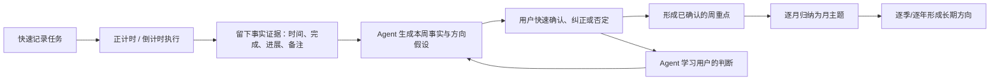

# Time Manager 产品研究与 V1 假设

> 状态：0 号研究底稿  
> 日期：2026-08-12  
> 研究范围：任务管理、时间追踪、目标管理、周期计划/复盘、AI 日程与 Agent 交互

## 0. 一句话结论

不要先做一款“能设置年/月/周/日目标的滴答清单”，而要做一款：

**用户只管记录任务和真实投入，系统从执行证据中形成方向假设；用户在短复盘中校正，Agent 再把这些被确认的认识逐层沉淀为周重点、月主题和年度方向。**

它的核心不是更多层级，而是一个越用越懂用户的闭环：

这里有一条必须守住的原则：

**花了时间，不等于取得进展；经常做，也不等于真正想做。**

因此，Agent 只能根据行为提出“推断”，不能擅自替用户宣布目标。产品价值来自“事实镜子 + 意义假设 + 用户选择”，而不是一个看起来很聪明的自动总结。

---

## 1. 原始洞察是否成立

### 1.1 成立的部分

主流任务工具很擅长回答：

- 我有哪些事要做？
- 今天先做什么？
- 事情放在哪个清单？
- 什么时候提醒？
- 我花了多少时间？

但普遍较弱的是：

- 我最近到底在推进什么？
- 哪些工作只是维持运转，哪些真的改变了结果？
- 本周的行动和本月、今年的方向有什么关系？
- 我嘴上说重要的事情，是否真的获得了时间？
- 为什么连续几周都没有推动某个方向？
- 我的目标是否应该根据真实行为和新认识发生变化？

这不是简单缺少一个“年计划”页面，而是任务事实与个人意义之间缺少一个持续更新的解释层。

### 1.2 需要修正的部分

“从历史使用中自动提炼年/月/周计划”这个想法有价值，但不能直接照字面实现，原因有三：

1. **过去行为会放大现状，不必然代表愿望。** 用户可能把大量时间花在救火、行政和他人请求上；直接从时间占比生成目标，会把被迫忙碌误认成长期志向。
2. **任务完成不等于成果完成。** “开了 5 次会、写了 3 份文档”是产出证据，不代表“产品方向更清晰”这个结果真的前进了。
3. **长期计划不能由短期样本过度外推。** 一周数据可以生成周复盘；四周数据可以提出月度主题；不足数月的数据不应该装作理解了用户的一年。

所以更准确的产品表述应是：

> Agent 从事实中发现“显现出来的优先级”，用户补充“主动选择的优先级”，产品持续揭示两者之间的一致与偏差。

这会比普通目标管理更有价值。例如：

> 你确认本月最重要的是发布产品，但过去两周 61% 的专注时间用在临时支持，直接推进发布的只有 2 次会话。要继续当前安排，还是保护两段发布相关的时间？

这不是汇报，而是一次有证据的选择。

---

## 2. 第一轮桌面调研

### 2.1 竞品分成五类

| 产品类型 | 代表产品 | 擅长什么 | 用户要维护什么 | 留下的空白 |
|---|---|---|---|---|
| 任务优先 | TickTick、Todoist | 快速捕获、清单、标签、日期、提醒、日历 | 清单和任务元数据 | 统计能说明“做了多少”，较难说明“为什么做、产生了什么改变” |
| 仪式优先 | Sunsama、Akiflow | 日计划、周目标、周复盘、收工仪式 | 周目标、任务与目标的关联、反思文字 | 复盘较强，但仍依赖用户提前定义和持续维护 |
| 调度优先 | Motion、Reclaim、Morgen | 自动排期、保护专注时间、冲突后重排 | 时长、截止时间、优先级、可用时间 | 解决“什么时候做”，不等于解决“为何值得做” |
| 目标优先 | Griply、Timestripe、Amazing Marvin | 年/月/周/日层级、目标进度、目标检查 | 先建目标树，再把任务/习惯挂上去 | 结构强，但维护成本正是许多用户最终放弃的原因 |
| AI 教练/总结 | Indy、SelfManager 及大量新 AI Planner | 对话梳理、生成计划、周期总结 | 对话输入、目标陈述或已有表格 | 容易停留在一次性生成；可解释的长期记忆和任务执行闭环仍不成熟 |

关键事实：

- TickTick 已经有任务、清单、日历、正计时/番茄、习惯、统计和 Summary。它的 Summary 能按时间、清单、标签和状态汇总任务，也能纳入专注数据，但主要产物仍是可编辑的任务汇总文本。[TickTick 功能概览](https://ticktick.com/features)、[Notes and Summary](https://help.ticktick.com/articles/7055780476358754304)、[Focus Statistics](https://help.ticktick.com/articles/7055781966800486400)
- Sunsama 已把周目标、周计划和周复盘做成明确仪式，复盘会展示目标、完成工作和时间分配；但用户仍需主动创建周目标并手工把任务与目标对齐。[Weekly Objectives](https://help.sunsama.com/docs/usage-guides/weekly-objectives/)、[Weekly Planning](https://help.sunsama.com/docs/usage-guides/weekly-objectives/weekly-planning/)、[Weekly Review](https://help.sunsama.com/docs/usage-guides/weekly-objectives/weekly-review/)
- Reclaim 的核心是让 AI 在日历上持续保护和重排任务、习惯与专注时间，并提供时间分布和周报；它优化的是日历可执行性。[Focus Time](https://reclaim.ai/features/focus-time)、[Tasks Overview](https://help.reclaim.ai/en/articles/5108936-tasks-overview-protect-time-for-task-work-before-deadlines)
- Griply 明确采用 Life Area → Vision → Goal → Task/Habit 的 Goal-First 层级；Timestripe 可以同时看日、周、月、季度、年乃至更长期目标；Amazing Marvin 也支持把任务和项目手动挂到目标并设置检查。[Griply Features](https://griply.app/help/features)、[Timestripe Horizons](https://timestripe.com/magazine/learning-center/tips-and-tricks/plan-bigger-with-timestripe-horizons/)、[Amazing Marvin Goals](https://help.amazingmarvin.com/en/articles/5015479-goals-objectives)

### 2.1.1 滴答清单深度拆解：不是功能列表，而是一套稳定的对象体系

结合 Web 端实机审计、滴答清单 MCP 暴露的领域对象和官方帮助中心，可以把滴答清单理解为七层：

| 层级 | 已验证能力 | 对本产品的意义 |
|---|---|---|
| 捕获 | 随处可见的快速添加、自然语言时间识别、桌面快捷键、微信/邮件/浏览器入口 | 先收下，再整理；创建任务时不能强迫用户维护目标关系 |
| 组织 | 文件夹 → 清单 → 分组 → 任务 → 最多五级子任务；另有标签、过滤器、智能清单 | 清单是主归属，标签是横向切片，过滤器是查询，不应混成一棵目标树 |
| 任务 | 文本、笔记、检查事项；日期/时间段、优先级、提醒、重复、标签、附件、评论、指派、进度、动态 | 正式数据模型应一次容纳这些扩展点，即使 V1 只开放其中一部分 |
| 视图 | 三栏列表、看板、时间线、日/周/月/年日历、四象限、摘要 | 同一批任务通过不同投影视图呈现，不应为每个视图复制业务对象 |
| 执行 | 番茄倒计时、正计时、任务关联、额外时间、手工修正、补记、多端同步 | 专注会话是独立事件，不是任务上的一个累计数字 |
| 习惯/纪念 | 布尔或计量习惯、重复规则、目标/步长/单位、时段分区、打卡日志、连续天数；公历/农历倒数日 | 习惯与任务都能成为轨迹证据，但生命周期与状态模型不同，不能硬塞进 Task |
| 回顾 | 周/月/年日历、任务摘要、专注趋势/时间线/热力图、习惯完成率 | 现有产品已经解决“发生了什么”；轨迹必须进一步回答“说明什么、方向怎样变化” |

Web 端几个值得直接继承的交互结论：

- 常驻窄功能栏负责模块切换；任务模块内部再使用清单导航、任务列表、详情面板三栏结构；
- 任务行保持紧凑，完成动作始终位于最靠前位置，详情按需在右侧展开；
- 任务创建是渐进式的：先输入标题，再补日期、优先级、标签和清单；
- 详情区把完成、日期、优先级放在顶部，把正文/检查事项放在中部，把清单、格式、评论和更多动作放在底部；
- 已完成任务在原列表内折叠展示，保留上下文，而不是完成后立即“消失”；
- 日历进入后收起清单导航，把空间让给时间轴；专注页面则采用“大计时器 + 概览/记录”的双栏结构；
- 习惯列表直接把近七日打卡入口、总打卡和当前连续放在同一行，详情再展示月历和日志；
- 摘要不是静态报告，而是一个可配置投影：日期、清单、状态、标签、优先级、指派人、分组、显示字段、模板、下一周期任务和 AI 内容优化。

官方资料也明确说明，滴答清单支持列表/看板/时间线三种清单视图、年/月/周/日等日历视图、任务与笔记互转、任务动态，以及按年/月/周查看专注趋势和按清单/标签/任务查看时间分布。[功能介绍](https://dida365.com/features?language=zh_CN)、[任务详情与编辑](https://help.dida365.com/articles/6950661731483910144)、[专注数据统计](https://help.dida365.com/articles/6950408300395495424)

这里的“复用”分为三种，不等于照搬品牌资产或逐像素复制：

1. **直接复用成熟交互范式**：Inbox、智能清单、三栏任务布局、快速添加、任务详情、完成折叠、正/倒计时、键盘优先和渐进式编辑；
2. **现在预留领域模型、分阶段开放 UI**：复杂重复、提醒、笔记/检查事项、标签/过滤器、看板/时间线、习惯、附件、评论、共享与多端同步；
3. **由轨迹重新设计**：摘要、周期复盘、方向识别、目标贡献和长期记忆。滴答摘要可作为“事实投影层”，轨迹负责证据化解释与跨周期学习。

### 2.2 真正值得占领的位置

竞品通常从以下三条路径之一出发：

1. 目标 → 拆任务；
2. 任务 → 自动排日历；
3. 完成记录 → 生成摘要。

本产品可以占领第四条路径：

> **真实执行 → 发现模式 → 提出方向 → 用户校正 → 指导下一轮执行。**

可将它称为“自下而上的意图发现”或“基于证据的个人方向系统”。

差异化不在于能否生成周报，而在于是否具备以下四件事：

- 每条判断都能回到任务、专注会话和用户记录；
- 明确区分事实、Agent 推断、用户确认；
- 用户一次纠正能影响未来，而不是下周重新犯错；
- 周、月、年不是重复总结原始任务，而是逐层基于已确认认识继续归纳。

### 2.3 用户反馈里反复出现的模式

公开用户讨论只能作为定性线索，不能代替访谈，但几个模式非常一致：

- 系统一复杂、维护步骤一多，用户就会停止使用；
- 很多人真正需要的是“今天少量重点 + 每周一次重置”；
- 用户会在 Todo、日历、Notion/笔记和纸之间拆分任务、目标与复盘；
- 目标树在理论上清晰，但现实变化后，周/月复盘最先被跳过；
- 只看日任务容易整周都在响应，直到周末才发现重要方向没有推进；
- 长列表会让任务系统变成压力来源甚至“失败记录”。

样例讨论：[复杂度让系统失效](https://www.reddit.com/r/productivity/comments/1rjzcov/i_stopped_trying_to_manage_my_full_task_list_and/)、[跨日/周/月/年维护困难](https://www.reddit.com/r/productivity/comments/164ixbu)、[始终陷在日任务里](https://www.reddit.com/r/Productivitycafe/comments/1tb97pn/daily_todo_lists_were_quietly_making_me_less/)、[工具本身增加负担](https://www.reddit.com/r/productivity/comments/1nij3xb/anyone_else_feel_overwhelmed_by_all_the/)。

### 2.4 研究对产品的启发

- 一项包含 138 个研究、19,951 名参与者的元分析发现，提高目标进展监测频率能促进目标达成，且在结果被实际记录时效果更大。产品因此应该帮助用户留下真实记录，而不是只展示漂亮总结。[Harkin et al., 2016](https://eprints.whiterose.ac.uk/id/eprint/91437/)
- 关于反思的实验与现场研究显示，“行动 + 有意反思”相较单纯继续行动能带来更好的学习表现。复盘不应完全被 Agent 消灭；Agent 应减少整理成本，把最后的意义判断留给用户。[Learning by Thinking](https://journals.aom.org/doi/10.5465/ambpp.2015.12709abstract)
- 关于 implementation intentions 的元分析表明，明确“何时、何地、如何行动”的 if-then 计划有助于目标实现。产品在复盘后不应只生成宏大目标，而要落到下一周可执行的时间/情境承诺。[Gollwitzer & Sheeran, 2006](https://www.socmot.uni-konstanz.de/publications/implementation-intentions-and-goal-achievement-meta-analysis-effects-and-processes)
- 人与 AI 的交互应清楚展示能力边界、支持快速否定和纠错、解释为何得出结论，并谨慎地随时间适应。这里尤其适用于“Agent 猜用户真正想要什么”这种高主观场景。[Microsoft Human-AI Guidelines](https://www.microsoft.com/en-us/research/?p=564561)

---

## 3. 产品定义

### 3.1 为谁做

V1 的首要用户不是所有需要待办事项的人，而是：

> **同时推进工作、个人成长或副业的个人知识工作者；已经会记录任务，也愿意用计时了解投入，但经常觉得“每天很忙，不知道长期是否在前进”。**

典型特征：

- 每天有 5–30 个显性或隐性任务；
- 工作包含大量模糊、跨多天、无法只靠勾选衡量的事项；
- 曾经使用 TickTick、Todoist、Notion、日历或纸笔中的两种以上；
- 想做周/月复盘，但不能长期坚持；
- 对自我认知和方向感的需求高于团队协作需求。

暂时不优先：

- 需要多人指派、审批、依赖关系和工时审计的团队项目管理；
- 只需要提醒买菜、交费的轻量用户；
- 只想自动排满日历、不愿记录任何执行反馈的用户；
- 需要严格 OKR 打分或绩效考核的组织。

### 3.2 用户要雇用它完成什么

核心 Job：

> 当我在很多日常任务之间奔波时，帮我用最少维护成本看清时间真正流向了哪里、哪些方向正在形成、哪些重要事情长期被忽略，并把这个认识转成下一周的少数选择。

三个子 Job：

1. **执行时**：别让我配置系统，帮我尽快进入当前任务并记录真实投入。
2. **收尾时**：别让我从零写复盘，先把事实与可能的含义整理好。
3. **转向时**：别拿旧目标绑架我，帮我看见行为与意图的偏差，并允许我改变方向。

### 3.3 产品承诺

建议的早期表达：

> 认真做事，方向会慢慢浮现。

功能性表达：

> 一个从你的任务与专注记录中学习，替你起草周复盘，并逐渐形成月度主题和长期方向的时间管理工具。

不建议表达为“AI 自动替你制定人生目标”，这既不可信，也容易制造反感。

---

## 4. 核心产品原则

### 4.1 任务是用户的输入模型，方向是系统的推断模型

用户仍然按照熟悉的方式使用 Inbox、清单、日期和任务。不要要求用户理解新的目标方法论才能开始。

### 4.2 清单不是目标

“工作”“个人”“产品 A”是组织容器，不应被系统直接当作用户目标。一个任务可以同时：

- 直接推动一个结果；
- 为另一个结果做准备；
- 只是维持运转；
- 是探索，尚不知道会通向哪里；
- 与当前方向无关但必须完成。

因此，贡献关系应是可变、可解释的多对多关系，而不是一棵僵硬的树。

### 4.3 事实、推断、承诺三层分开

| 层级 | 示例 | 谁可修改 |
|---|---|---|
| 事实 | 为“访谈提纲”专注 52 分钟，任务进展到 70% | 用户；系统记录 |
| 推断 | 这可能在推动“验证目标用户问题” | Agent 提议，用户纠正 |
| 承诺 | 下周完成 5 次用户访谈 | 用户确认后成立 |

UI 上必须看得出三者不同。

### 4.4 长周期只建立在已确认的短周期之上

- 周复盘：基于任务、会话、进展记录和日历事实生成；
- 月复盘：主要基于用户确认过的周复盘，再下钻原始证据；
- 年度方向：主要基于确认过的月度主题和关键转向，而不是把全年任务重新塞给模型总结。

这是产品可信度和长期记忆的基础。

### 4.5 不伪造进度百分比

除非用户定义了可测结果（如收入、体重、完成章节数），否则不要因为完成 3/5 个任务就宣布目标进度 60%。默认展示：

- 投入时间；
- 有证据的推进事件；
- 最近趋势；
- 阻塞；
- Agent 判断的贡献强弱和置信度。

### 4.6 纠正必须比配置更便宜

用户应该能对 Agent 的判断执行：

- 对，就是这个方向；
- 关联错了，改到另一个方向；
- 只是维持/行政，不算进展；
- 这是探索，先不要定性；
- 不要再从这类任务学习；
- 这个方向已经不重要了。

一次选择最好在一两次点击内完成，并明确告知“这会怎样影响后续判断”。

### 4.7 复盘不能变成绩效审判

少用完成率、连胜、红色逾期和人格化批评。重点是帮助用户分辨：发生了什么、为什么、接下来改变什么。

---

## 5. V1 产品形态

### 5.1 V1 只做四个主空间

#### A. 今天

用户每天绝大部分时间所在：

- 快速添加任务；
- 展示今日任务和 Inbox；
- 从全部任务里选“今日重点”，建议最多 3 个；
- 每个任务可直接开始正计时或倒计时；
- 显示当前进展、累计投入和最近一次进展记录；
- 完成、推迟、放弃；
- Agent 只做轻提示，不占据主界面。

#### B. 清单

提供足够替代基础 Todo 工具的组织能力：

- Inbox 和自定义清单；
- 任务、子任务、备注；
- 截止日期、计划日期、优先级；
- 基础重复任务；
- 搜索和已完成任务；
- 快速输入，后续再加入自然语言解析。

V1 不一次开放 TickTick 的日历、习惯、矩阵、协作、附件和复杂筛选器，但正式领域模型、事件模型和组件体系需要为这些已验证能力保留兼容空间，避免后续重写任务内核。

#### C. 专注

专注不是独立的番茄装饰，而是最重要的事实采集入口：

- 正计时：适合不确定时长的工作；
- 倒计时：适合 15/25/50/90 分钟承诺；
- 暂停、继续、结束；
- 结束时只问一个轻问题：`完成了 / 有推进 / 被阻塞 / 只是处理事务`；
- 可选一句进展备注；
- 可调整误计的时长；
- 多次会话累计到同一任务，但保留每次会话记录。

这一个轻问题会显著提高 Agent 对“投入”和“成果”的区分能力。

#### D. 轨迹

不是四套年/月/周/日页面，而是一个逐层展开的方向空间：

- **本周**：事实回放、主要推进、维持性工作、阻塞、时间偏差、下周建议；
- **本月**：由已确认周复盘形成的主题、阶段性结果、反复出现的阻塞；
- **今年**：当前长期方向、已发生的关键转向、长期忽视的领域；
- 每条方向都能展开查看证据和历史版本；
- 低数据量时诚实展示“还在了解你”，而不是生成空洞内容。

### 5.2 最关键的 V1 流程：3 分钟周闭环

周复盘不能是一张长篇 AI 报告。建议分三步：

#### 第一步：镜子——本周发生了什么

只呈现事实：

- 专注总时间和有效会话；
- 完成/推进/阻塞的任务；
- 时间主要流向哪些清单或已确认方向；
- 临时任务和计划外工作占比；
- 与上周相比最明显的变化。

用户无需编辑，最多修正漏记。

#### 第二步：意义——Agent 看到了什么

最多 3–5 张判断卡：

- “你似乎在推进：验证时间管理产品的核心问题”
- “6 小时投入中，4.2 小时是竞品和用户研究；这是直接推进还是探索？”
- “原计划中的原型没有发生，可能被研究范围扩大挤压。”
- “连续三周有文档整理工作，它更像长期能力建设还是日常维护？”

每张卡附证据、置信度和快速纠正入口。

#### 第三步：选择——下周保留什么

Agent 只提议 1–3 个下周重点，并要求用户确认：

- 继续；
- 缩小；
- 暂停；
- 新增一个用户自己说出的重点。

每个重点至少落成一个具体行动或时间承诺。例如：

> 如果周二上午 9:30 没有会议，我将用 50 分钟完成访谈提纲并发出第一批邀请。

### 5.3 冷启动节奏

| 使用阶段 | Agent 应做什么 | 不应做什么 |
|---|---|---|
| 第 1 天 | 帮助记录、计时、解释会学习哪些信号 | 宣布用户的长期目标 |
| 3 个有效会话后 | 提示初步任务主题，询问一次是否理解正确 | 自动创建一堆目标 |
| 第 1 周 | 生成第一份周复盘草稿和 1–3 个方向假设 | 假装知道月计划 |
| 第 4 周 | 基于已确认周复盘生成首份月度主题 | 把时间最多的事情直接命名为人生目标 |
| 3 个月后 | 提出年度方向候选、变化趋势和长期偏差 | 用单一完成率衡量人生进展 |

Onboarding 最多问两个问题：

1. 最近一个月，有什么事情是你希望真正推进的？（可跳过）
2. 哪些数据允许 Agent 用来学习：任务标题、备注、清单、专注记录、日历？

第一个答案是“主动意图”，后续行为是“显现优先级”。两者的差异是产品最有价值的洞察来源之一。

---

## 6. 概念数据模型

V1 不必在 UI 暴露全部概念，但底层应避免锁死成目标树。

### 6.1 用户直接维护的对象

- `List`：组织任务的容器；
- `Task`：标题、状态、计划/截止日期、优先级、当前进展；
- `FocusSession`：开始、结束、模式、时长、关联任务；
- `ProgressEvent`：完成、有推进、阻塞、事务、备注、可选数值变化；
- `ReflectionInput`：用户在复盘中的文字或选择。

### 6.2 Agent 维护、用户可校正的对象

- `Theme`：跨任务反复出现的工作流或关注领域，例如“时间管理产品研究”；
- `PeriodIntent`：特定周期内的重点/结果，周期为 week、month、year；
- `ContributionEdge`：任务、会话、进展事件或短周期重点对另一个方向的贡献；
- `Insight`：模式、偏差、阻塞、变化或建议；
- `MemoryRule`：用户纠正后形成的偏好，例如“周报整理属于行政，不算产品推进”。

### 6.3 每条推断关系至少包含

- 来源证据；
- 目标方向；
- 关系类型：直接、支持、维持、探索、无关；
- 置信度；
- Agent 理由；
- 来源：系统推断或用户确认；
- 有效时间范围；
- 版本和修订记录。

这样才能支持“当时这样理解，后来用户改变了看法”，而不是偷偷重写历史。

---

## 7. Agent 应怎样工作

### 7.1 不要做一个万能聊天框

V1 的 Agent 应嵌入明确时机：

- 会话结束时：采集最小进展信号；
- 每日结束时：可选 30 秒事实确认；
- 周末/周初：生成复盘并确认下周重点；
- 月末：合并已确认周认识；
- 用户主动问“我最近为什么没有推进 X？”时：基于证据回答。

聊天是补充入口，不是信息架构。

### 7.2 从 V1 就采用开源 Agent SDK，但先保持单 Agent

技术基线调整为 TypeScript 版 OpenAI Agents SDK（`@openai/agents`）。它采用 MIT 许可证，提供 Agent、工具、结构化输出、Guardrail、Session、Tracing、Handoff 和 human-in-the-loop；同时支持自定义 `Model` / `ModelProvider`，适合当前 TypeScript 全栈并保留模型供应商替换能力。[OpenAI Agents SDK](https://github.com/openai/openai-agents-js)、[Agents](https://openai.github.io/openai-agents-js/guides/agents/)、[Tracing](https://openai.github.io/openai-agents-js/guides/tracing/)

V1 先定义一个 `TrajectoryReviewAgent`，接入以下确定性工具：

- `get_period_snapshot`：返回经 SQL 计算并冻结的周期事实；
- `search_evidence`：只在用户授权范围内搜索任务、专注和进展事件；
- `get_confirmed_memories`：读取用户已确认的方向、映射和排除规则；
- `compare_periods`：返回可复现的环比变化；
- `propose_contribution_edges`：提出任务/事件到方向的候选关系；
- `validate_review_evidence`：检查引用存在性、数字一致性和周期边界。

SDK 负责运行循环、工具调用、结构化输出、Guardrail、Tracing 和中断恢复；业务代码仍负责统计、权限、证据校验、幂等、周期调度和长期记忆。不能把 SDK 的 Session 当作产品记忆，也不能让 Agent 自己计算关键指标。

为避免未来被单一 SDK 锁死，业务层只依赖四个内部接口：

- `AgentRunner`：运行、暂停、恢复一次复盘；
- `ModelGateway`：选择模型、预算和推理强度；
- `MemoryRepository`：读取候选记忆和写入用户已确认记忆；
- `TraceSink`：保存 Agent run、tool span、模型用量和评测标签。

多 Agent 作为演进能力保留，但不为了“用了 Agent SDK”而过早拆分。只有当评测证明专业化能提升质量时，才拆为 `EvidenceAgent`、`DirectionAgent`、`PlanningAgent`，由 `ReviewManagerAgent` 统一负责最终输出和用户确认。

### 7.3 周复盘生成管线

1. 确定周期边界和时区；
2. 拉取任务状态变化、专注会话、进展事件和用户备注；
3. 将重复任务、拆分任务和多次会话聚合为可理解的工作单元；
4. 区分投入、产出、结果证据；
5. 与上周已确认重点和本月主题比较；
6. 生成事实摘要；
7. 生成最多 3–5 个可证伪的方向/偏差假设；
8. 为每个判断附证据和置信度；
9. 用户确认或纠正；
10. 保存不可变的本周快照，并更新长期记忆。

### 7.4 置信度策略

- 高置信：用户曾确认过同类映射，任务标题/备注明确，且行为连续；
- 中置信：语义相近、位于相关清单、有多次会话，但用户未确认；
- 低置信：仅凭标题猜测或第一次出现。

低置信关系不应自动计入“方向进展”，只在复盘中作为待确认候选出现。

### 7.5 必须可回答“为什么”

例如系统说“本周研究投入上升”，用户点开后应看到：

- 4 个相关任务；
- 7 次专注会话；
- 共 4 小时 12 分；
- 两条进展备注；
- 与上周 1 小时 35 分的比较；
- 为什么这些任务被归为研究。

### 7.6 隐私边界

时间管理数据会暴露工作内容、健康、关系和个人志向。V1 就应具备：

- 用户可选择哪些字段参与 Agent 分析；
- 单个清单可设为不学习；
- 删除历史后可重新生成相关记忆；
- 清楚区分原始数据、模型生成内容和长期记忆；
- 支持导出；
- 不默认把个人复盘用于社交或团队汇报。

---

## 8. V1 范围

### 8.1 必须有

- 单用户 Web 应用；
- Inbox、自定义清单和基础任务管理；
- Today 视图与最多 3 个今日重点；
- 任务正计时、倒计时；
- 会话结束后的轻量进展记录；
- 任务累计时间和进展时间线；
- 第一周即可用的 Agent 周复盘；
- 证据化的方向/贡献提议；
- 接受、改关联、标记维护/探索、排除学习；
- 下周 1–3 个重点确认；
- 基于确认周复盘生成月度主题；
- 基础数据导出与 Agent 隐私控制。

### 8.2 可以稍后

- 日历双向同步和自动 time blocking；
- 手机原生 App、桌面全局快捷键；
- 浏览器插件、语音录入；
- 习惯追踪；
- 附件、复杂 Markdown；
- 多人共享和任务分派；
- 自定义筛选器/智能清单；
- 完整年复盘（应等待真实纵向数据）；
- Agent 自动执行外部操作。

### 8.3 明确不做

- 要求用户在开始前搭建人生领域 → 愿景 → 年目标 → 月目标 → 周目标 → 任务的完整树；
- 用完成任务数量当作生产力分数；
- 自动生成不可追溯的目标进度百分比；
- 每次新增任务都弹出“关联哪个目标”；
- 为展示 AI 而强迫用户聊天；
- V1 就做团队项目管理。

---

## 9. 最小可行验证，不先赌完整产品

真正风险不在任务增删改查，而在用户是否信任并持续使用“方向推断”。建议先做 4 周 Concierge 验证。

### 9.1 需要验证的五个假设

| 假设 | 最小测试 | 成功信号 |
|---|---|---|
| H1 用户愿意留下足够执行证据 | 让目标用户用简化任务 + 计时原型 1 周 | 每周至少 5 次有效会话，结束反馈填写率 > 60% |
| H2 Agent 能生成有用而非空洞的方向假设 | 人工 + LLM 为每人生成周复盘 | 至少 70% 判断被接受或轻改；用户能指出至少一个此前没看见的偏差 |
| H3 校正成本足够低 | 让用户完成卡片式复盘 | 中位完成时间 < 3 分钟；大多数用户愿意下周继续 |
| H4 短周期确认能改善长周期质量 | 连续 4 周后生成月复盘 | 月复盘主要结论能被用户认可，且证据可追溯 |
| H5 方向洞察会改变下一周行为 | 比较复盘前后两周 | 至少一个被确认重点在下一周获得明确任务或专注会话 |

数字只是早期门槛，不是最终 KPI；样本很小时应结合访谈原话判断。

### 9.2 研究样本

- 8–12 次问题访谈：独立开发者、产品/设计/研发知识工作者、研究生或内容创作者；
- 6–10 人进入 4 周试用；
- 至少一半是现有 TickTick/Todoist/Notion 重度用户；
- 筛选条件：过去 3 个月至少尝试过一次周复盘或明确想做但反复失败。

### 9.3 访谈不要问“你想不想要 AI 复盘”

应要求对方打开最近一周真实记录，并追问：

- 上一次周复盘是什么时候？具体怎么做？花了多久？
- 哪一步最容易被跳过？
- 最近一次觉得“忙了一周但没进展”是什么情境？
- 你如何判断一个任务是否真的推动目标？
- 最近放弃或改变过什么目标？工具有没有帮助你看见它？
- 如果系统判断错了，你愿意怎样纠正？最多能接受几步？
- 哪些任务或清单绝不希望模型读取？

### 9.4 原型顺序

1. **可点击原型**：验证 Today、专注结束、周复盘三段流程；
2. **SDK 驱动的 Concierge 周复盘**：从第一天用 Agent SDK 跑真实工作流，但由人工审核洞察质量并积累评测样本；
3. **薄任务内核**：让 6–10 人真实使用 4 周；
4. **自动化推断**：只替代已经反复出现且规则清楚的人工步骤；
5. **月度归纳**：验证分层记忆是否比直接总结全部任务更可靠。

---

## 10. 成功指标

### 10.1 北极星指标

建议定义为：

> **完成学习闭环的有效周数**

一个有效周同时满足：

- 有至少 3 次真实专注/进展记录；
- 用户查看并确认或修改了周复盘；
- 用户明确选择了下一周至少一个重点；
- 下一周对该重点产生至少一次直接推进证据。

它衡量的不是“用户勾了多少任务”，而是产品是否真的帮助用户从行动中学习，并把学习带回行动。

### 10.2 关键辅助指标

- 首次有效会话完成率；
- 会话结束反馈率；
- 周复盘触达、开始、完成率；
- 周复盘中位完成时长；
- Agent 判断接受、修改、否定比例；
- 证据展开率；
- 同类推断的重复纠错率；
- 被确认重点在下一周期获得推进证据的比例；
- 第 4 周仍完成学习闭环的用户比例；
- 用户自评：“我比一周前更清楚自己正在推进什么”。

### 10.3 需要警惕的反指标

- 为了提高时长而诱导用户过度计时；
- 为了完成率而减少有意义但困难的任务；
- Agent 生成越来越长，用户实际越来越少读；
- 接受率很高只是因为用户懒得纠正；
- 用户因被评价、内疚或隐私担忧而减少真实记录。

---

## 11. 主要风险与应对

### 风险一：替代 TickTick 的基础成本太高

应对：先完成滴答能力地图与兼容数据模型，再按“捕获 → 组织 → 执行 → 回顾”的依赖顺序实施；V1 不一次开放全部功能，但任何省略都必须是阶段性优先级，而不是未经研究的产品删减。

### 风险二：没有足够历史数据，Agent 无话可说

应对：冷启动先提供执行价值；分阶段开放周、月、年；允许导入任务历史，但不对低质量历史做过度承诺。

补充：TickTick 官方 Open API v1 对 Inbox、已完成任务、习惯和专注记录等访问有限，不能把无缝迁移建立在官方 API 能提供完整历史的假设上。早期更现实的是 CSV/备份导入加产品内重新积累专注数据。[相关 API 限制说明](https://pkg.go.dev/github.com/slavkluev/go-ticktick)

### 风险三：语义推断经常错，信任快速崩溃

应对：低置信只提问、不计进展；展示证据；一键纠正；记录纠正规则；衡量重复犯错率。

### 风险四：用户把“真实花时间”误当“理应花时间”

应对：长期同时展示主动意图与显现优先级，重点解释差异，不把其中任何一方自动判为正确。

### 风险五：复盘又变成新的维护负担

应对：默认 3 分钟、最多 3–5 个判断、最多 3 个下周重点；深度内容按需展开。

### 风险六：产品制造生产力焦虑

应对：支持“放弃/不做也是决定”；区分休息、维持与推进；不使用羞辱性提示；允许完全不计时的私人清单。

### 风险七：摘要看起来好，但不改变行为

应对：复盘必须以一个下一周期选择结束，并在后续 Today 中温和呈现这个选择；检验是否产生直接推进证据。

---

## 12. 当前建议的 V1 叙事

V1 的产品故事不应是：

> 一个比滴答清单多了年/月/周/日目标和 AI 的任务工具。

而应是：

> 你照常记任务、开始计时、推进工作。每周，Agent 用真实记录替你还原发生了什么，提出少数有证据的方向判断。你只需纠正和选择。随着这些确认不断累积，月度主题和长期方向自然浮现，不再需要手工维护一棵脆弱的目标树。

最小闭环只有五个动作：

1. 记下任务；
2. 开始一次专注；
3. 结束时标记结果；
4. 每周确认 Agent 的理解；
5. 选择下周最重要的 1–3 件事。

如果这五步不能让用户在四周后明显更清楚“我在把时间花到哪里、我接下来真正要推动什么”，那么再多日历、图表和 Agent 功能都不是答案。

---

## 13. 下一阶段决策门

在开始完整 UI 和工程实现前，建议依次回答：

1. 目标用户是否愿意把任务执行计时作为日常动作？
2. 会话结束时哪个最小反馈集合既不打扰，又足以区分“投入、推进、阻塞、维持”？
3. 一份真正有用的周复盘，其 3–5 张判断卡具体长什么样？
4. 用户更信任“Agent 自动聚类后让我纠正”，还是“复盘时只问少量问题再归纳”？
5. 下周重点如何进入 Today，既能提醒方向又不形成新的层级维护？
6. 用户是否愿意从现有任务工具迁移；若不愿，第一阶段应是完整任务工具还是伴生式复盘工具？

其中第 6 个问题会改变产品和工程范围最大，应该通过真实用户测试而不是内部想象决定。

第一轮推荐路线是：**产品设计层完整吸收滴答清单已经验证的能力，工程层先实现“高兼容任务内核 + 真实计时 + Agent SDK 周学习闭环”，再按用户价值逐步开放日历、习惯、看板、时间线和协作，而不是重新发明这些成熟交互。**
