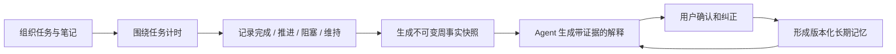
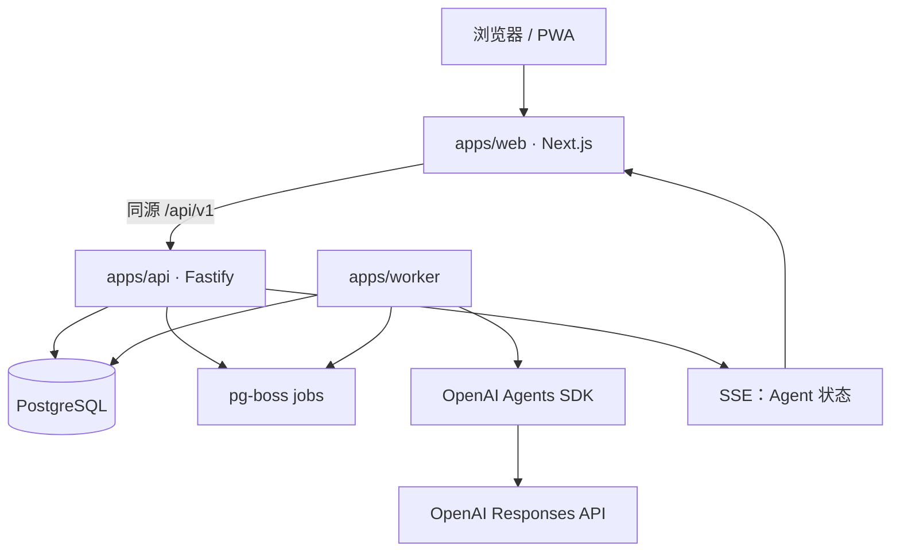
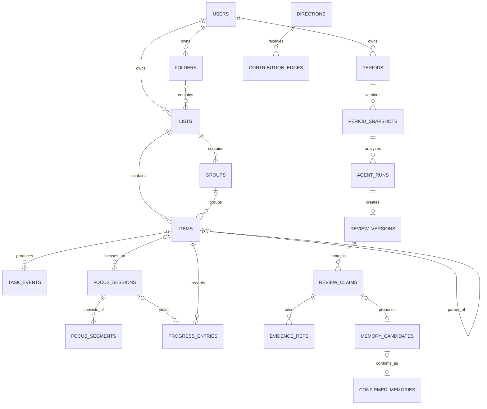
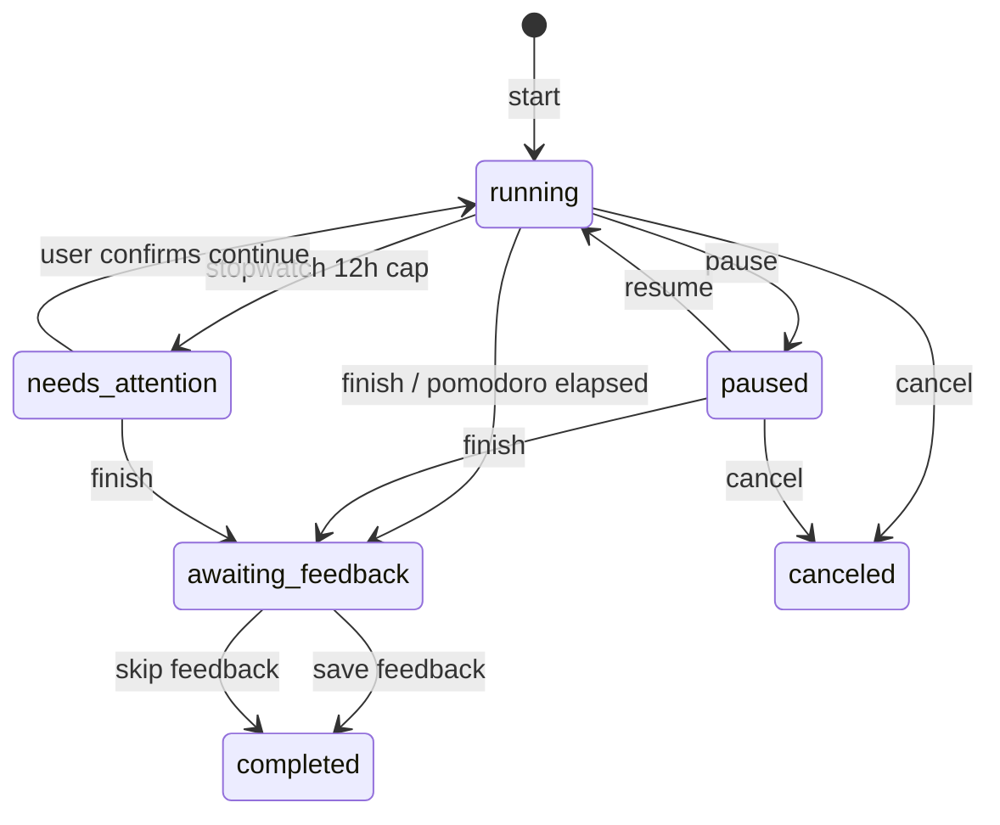

# 见时 V1 技术方案：最小行动—轨迹闭环

> 对应 PRD：[PRD-v1-minimum-loop.md](./PRD-v1-minimum-loop.md)  
> 版本：Technical Design v0.1  
> 日期：2026-08-12  
> 状态：架构确认稿  
> 范围：任务组织、番茄/正计时与进展、周轨迹与长期记忆

## 1. 技术目标

本方案只服务一个闭环：



技术设计必须保证：

1. Agent 不可用时，任务与计时仍然完整可用；
2. 计时结果能被准确恢复、修正和审计；
3. 周轨迹中的事实可以从原始数据重复计算；
4. 每条 Agent 判断都能回到授权范围内的证据；
5. Agent 不能未经用户确认写入长期记忆；
6. V1 保持足够简单，能够由小团队持续迭代。

## 2. 核心技术决策

| 领域 | 选择 | 决策理由 |
|---|---|---|
| 总体架构 | TypeScript 模块化单体，Web/API/Worker 三个进程 | 保留清晰边界，但不承担微服务的网络和运维成本 |
| Web | Next.js 16、React 19、TypeScript | 复用当前原型技术基础，支持服务端页面壳和客户端高交互区域 |
| UI | Tailwind CSS 4、Radix UI、Lucide、dnd-kit | 高密度桌面交互、无障碍基础和拖动排序 |
| 服务端状态 | TanStack Query | 缓存、乐观更新、失败回滚与请求去重 |
| 本地状态 | Zustand | 当前选择、计时显示、编辑草稿等临时状态 |
| 富文本 | Tiptap / ProseMirror JSON | 任务正文与笔记共用块模型，原生支持 task list |
| API | Fastify 5 + JSON Schema/Zod + OpenAPI | 独立稳定 REST API，未来可直接服务移动端 |
| 数据库 | PostgreSQL 17+ | 事务、约束、JSONB、全文检索和任务队列共用一个事实源 |
| ORM | Drizzle ORM + SQL migrations | 类型安全，同时允许关键约束和索引使用原生 SQL |
| 后台任务 | pg-boss | 直接使用 PostgreSQL，支持事务内入队、定时、重试和死信，无需 Redis |
| 身份认证 | Better Auth + PostgreSQL session | 开源、数据库会话可撤销，并有 Drizzle 适配器 |
| Agent | `@openai/agents` TypeScript SDK | 开源、工具/结构化输出/Guardrail/Tracing/HITL 能力完整 |
| Agent API | OpenAI Responses API，模型配置化 | 支持 Agent 工作流；业务代码不硬编码模型名称 |
| 可观测性 | OpenTelemetry + Pino + Sentry | 串联 Web、API、Worker 和 Agent run |
| 测试 | Vitest、Testcontainers、Playwright、Agent evals | 覆盖领域逻辑、数据库约束、端到端闭环和模型回归 |

### 2.1 暂不引入的基础设施

V1 不引入：

- Redis：任务量与异步吞吐尚不需要，pg-boss 足够；
- 独立向量数据库或 pgvector：周证据规模很小，先使用结构化查询和 PostgreSQL 全文检索；
- 对象存储：V1 没有附件；
- WebSocket：计时显示在客户端计算，Agent 状态用 SSE；
- Temporal：V1 Agent 工作流步骤少，队列 + 持久化状态机足够；
- Kafka/事件总线：所有模块共享一个 PostgreSQL；
- 全量 Event Sourcing：保留审计事件，但当前状态仍由业务表直接存储。

这些是明确的延后决策，不是永久排除。当吞吐、跨月检索或流程复杂度达到触发条件时再引入。

## 3. 系统架构

### 3.1 运行拓扑



部署时它们是三个进程，但仍属于同一个模块化单体：

- 同一代码仓库；
- 同一领域模型；
- 同一 PostgreSQL；
- 同一发布版本；
- 不通过内部 HTTP 相互调用，API 与 Worker 共享领域包和仓储实现。

### 3.2 为什么不把后端全部放进 Next.js

任务 CRUD 可以放进 Next.js Route Handler，但计时事务、定时任务、Agent 长任务、失败重试和未来移动客户端需要稳定的服务边界。因此：

- Next.js 负责页面壳、路由、首屏和客户端应用；
- Fastify 负责认证后的业务 API；
- Worker 负责定时、快照和 Agent 执行；
- `/api/*` 通过反向代理保持同源，避免浏览器跨域和双重认证。

Next.js 官方建议只把需要状态、事件处理和浏览器 API 的部分设为 Client Component，因此页面布局和首屏可以服务端渲染，任务列表、编辑器、拖动与计时器作为客户端交互岛。[Next.js Server/Client Components](https://nextjs.org/docs/app/getting-started/server-and-client-components)

## 4. 代码仓库结构

当前 Sites/vinext 项目保留为交互原型；正式实现将仓库调整为 pnpm workspace：

```text
time-manager/
├── apps/
│   ├── web/                 # Next.js UI
│   ├── api/                 # Fastify HTTP API
│   └── worker/              # pg-boss consumers / scheduler / Agent runs
├── packages/
│   ├── contracts/           # Zod schemas、DTO、OpenAPI contracts
│   ├── domain/              # 纯领域模型、命令、状态机
│   ├── db/                  # Drizzle schema、repositories、migrations
│   ├── auth/                # Better Auth 配置与鉴权适配
│   ├── agent/               # AgentRunner、tools、schemas、guards、prompts
│   ├── ui/                  # 共享组件和 design tokens
│   ├── observability/       # tracing、logging、metrics
│   └── config/              # 类型化环境变量与共享 tsconfig
├── evals/
│   ├── fixtures/            # 匿名/合成周期快照
│   ├── graders/             # 证据、事实、风格和一致性 grader
│   └── baselines/           # 通过评审的输出基线
├── migrations/
├── tests/
└── work/
```

### 4.1 后端模块边界

```text
modules/
├── organization/  # folders、lists、groups
├── items/         # tasks、subtasks、notes、content
├── focus/         # sessions、segments、adjustments
├── progress/      # progress entries、task timeline
├── trajectory/    # periods、snapshots、reviews、claims
├── memory/        # candidates、confirmed memories、directions
└── identity/      # users、sessions、preferences
```

模块只通过应用服务接口调用，不直接读取其他模块的表。V1 不建立网络服务边界。

### 4.2 领域层约束

`packages/domain` 不依赖 Next.js、Fastify、Drizzle、OpenAI SDK：

- 定义实体、值对象和状态机；
- 定义 repository、clock、ID generator、AgentRunner 等接口；
- 领域服务接受明确的 `UserScope`；
- 基础设施包实现接口。

这样 Agent SDK、数据库或 Web 框架升级不会扩散到核心规则。

## 5. 数据设计总则

### 5.1 标识与时间

- 主键统一使用应用端生成的 UUIDv7；
- 数据库存储统一使用 `timestamptz` 和 UTC；
- 用户时区使用 IANA 标识，如 `Asia/Shanghai`；
- 业务日期使用 `date`，不使用零点时间戳代替；
- 同时记录 `occurred_at` 与 `recorded_at`，支持补记和事后修正；
- 前后端传输时间使用 RFC 3339。

### 5.2 当前状态 + 追加审计事件

V1 不做完整 Event Sourcing：

- `items`、`focus_sessions` 等表保存当前状态，便于查询；
- `task_events`、`focus_adjustments`、`progress_entries` 追加保存事实；
- 一次状态变更与对应审计事件在同一数据库事务中提交；
- 轨迹从状态表和事件表生成快照；
- 审计事件暂不用于重建所有业务表。

这在可解释性和开发复杂度之间取得平衡。

### 5.3 多租户隔离

- 每张用户数据表都包含 `user_id`；
- repository 的所有方法必须接受 `UserScope`，禁止裸 `findById(id)`；
- 关联关系使用包含 `user_id` 的复合约束，防止跨用户关联；
- API 不接受客户端传入的 `user_id`，始终从 session 注入；
- 测试必须覆盖跨用户 ID 猜测和证据越权；
- 后续可增加 PostgreSQL RLS 作为纵深防御，V1 先避免连接池 session 变量带来的复杂度。

## 6. 核心数据模型

以下字段省略通用的 `created_at`、`updated_at` 和必要索引。

### 6.1 身份与偏好

#### `users`

| 字段 | 类型 | 说明 |
|---|---|---|
| `id` | uuid | 用户 ID |
| `email` | text | 唯一登录标识 |
| `timezone` | text | IANA 时区，默认 `Asia/Shanghai` |
| `week_starts_on` | smallint | V1 固定 1（周一），保留字段 |
| `agent_enabled` | boolean | 是否允许轨迹分析 |

认证所需的 session/account 表由 Better Auth 生成。采用数据库 session，支持撤销设备会话；Better Auth 提供 Drizzle 适配和传统 Cookie session。[Better Auth Drizzle Adapter](https://better-auth.com/docs/adapters/drizzle)、[Session Management](https://better-auth.com/docs/concepts/session-management)

### 6.2 组织结构

#### `folders`

- `id`, `user_id`
- `name`
- `position_key`
- `archived_at`
- `revision`

#### `lists`

- `id`, `user_id`
- `folder_id` nullable
- `name`
- `position_key`
- `is_inbox`
- `learning_policy`: `include | exclude`
- `archived_at`
- `revision`

约束：每个用户只能有一个未删除的 Inbox。

#### `groups`

- `id`, `user_id`, `list_id`
- `name`
- `position_key`
- `archived_at`
- `revision`

`position_key` 使用 fractional indexing 字符串。拖动时只改动目标项，后台在 key 过长时低优先级重排。

### 6.3 任务、子任务与笔记

统一表 `items`：

| 字段 | 类型 | 说明 |
|---|---|---|
| `id` | uuid | 内容 ID |
| `user_id` | uuid | 所属用户 |
| `list_id` | uuid | 所属清单 |
| `group_id` | uuid nullable | 所属分组 |
| `parent_task_id` | uuid nullable | 子任务父级 |
| `kind` | enum | `task | note` |
| `title` | text | 必填 |
| `status` | enum nullable | task: `pending/completed/abandoned`；note: null |
| `priority` | smallint nullable | 0/1/3/5 |
| `planned_on` | date nullable | V1 计划日期 |
| `content_doc` | jsonb | Tiptap JSON 文档 |
| `content_text` | text | 服务端提取的纯文本，用于检索/Agent |
| `position_key` | text | 排序 |
| `completed_at` | timestamptz nullable | 完成时间 |
| `abandoned_at` | timestamptz nullable | 放弃时间 |
| `revision` | integer | 乐观锁版本 |
| `deleted_at` | timestamptz nullable | 软删除 |

关键约束：

- note 的 `status`、`priority`、`parent_task_id` 必须为空；
- task 的 `status` 必须非空；
- `parent_task_id` 只能指向 task；
- V1 应用层拒绝父任务已有父级的情况，保证 UI 只有一层子任务；
- group 必须属于同一个 list 和 user；
- 标题去除首尾空格后不能为空；
- task 完成、放弃与 pending 的时间字段必须一致。

Tiptap 官方建议将 JSON 作为持久化格式，且 task list 是标准扩展；因此 V1 不把每个正文块拆成数据库行，而将完整 ProseMirror JSON 存入 `content_doc`，同步维护 `content_text`。[Tiptap Persistence](https://tiptap.dev/docs/editor/core-concepts/persistence)、[TaskList](https://tiptap.dev/docs/editor/extensions/nodes/task-list)

正文写入规则：

- 客户端发送完整 JSON 文档和 `expectedRevision`；
- API 使用固定 Tiptap JSON Schema 校验；
- 服务端从 JSON 提取纯文本；
- 800ms 防抖自动保存，失焦时立即保存；
- 冲突时不静默覆盖，返回 409 和最新版本供用户选择。

### 6.4 任务动态

#### `task_events`

| 字段 | 类型 | 说明 |
|---|---|---|
| `id` | uuid | 事件 ID |
| `user_id` | uuid | 用户作用域 |
| `task_id` | uuid | 任务/子任务 ID |
| `event_type` | text | created/title_changed/moved/completed/... |
| `actor_type` | text | user/system |
| `occurred_at` | timestamptz | 实际发生时间 |
| `recorded_at` | timestamptz | 写入时间 |
| `payload` | jsonb | 变更前后值、关联对象等 |
| `dedupe_key` | text nullable | 幂等键 |

`task_events` 只记录任务和子任务；独立笔记编辑不进入轨迹事实，减少噪声。笔记可以被 Agent 读取的能力留到后续显式授权。

### 6.5 专注会话

#### `focus_sessions`

| 字段 | 类型 | 说明 |
|---|---|---|
| `id` | uuid | 会话 ID |
| `user_id` | uuid | 所属用户 |
| `task_id` | uuid nullable | 关联任务/子任务 |
| `mode` | enum | `pomodoro | stopwatch` |
| `state` | enum | `running | paused | awaiting_feedback | completed | canceled | needs_attention` |
| `planned_seconds` | integer nullable | 番茄目标时长 |
| `started_at` | timestamptz | 首次开始时间 |
| `ended_at` | timestamptz nullable | 最终结束时间 |
| `base_active_seconds` | integer | 已关闭 segment 汇总缓存 |
| `effective_seconds` | integer nullable | 结束后的最终有效时长 |
| `revision` | integer | 状态机乐观锁 |

#### `focus_segments`

- `id`, `user_id`, `session_id`
- `started_at`
- `ended_at` nullable
- `close_reason`: pause/finish/pomodoro_elapsed/limit/cancel

每次 resume 创建新 segment，每次 pause/finish 关闭当前 segment。真实时长等于所有 segment 时长之和，而不是依赖浏览器每秒写入。

#### `focus_adjustments`

- `id`, `user_id`, `session_id`
- `before_seconds`, `after_seconds`
- `reason`
- `created_at`

#### 关键数据库约束

```sql
CREATE UNIQUE INDEX one_open_focus_per_user
ON focus_sessions (user_id)
WHERE state IN ('running', 'paused', 'needs_attention');

CREATE UNIQUE INDEX one_open_segment_per_session
ON focus_segments (session_id)
WHERE ended_at IS NULL;
```

状态转换在数据库事务中锁定 session 行，修改 session、segment、task_event 和进展记录后一起提交。

### 6.6 进展记录

#### `progress_entries`

- `id`, `user_id`, `task_id`
- `focus_session_id` nullable
- `source`: `focus_end | manual`
- `outcome`: `completed | progressed | blocked | maintenance | note`
- `note` nullable
- `next_step` nullable
- `occurred_at`, `recorded_at`
- `deleted_at` nullable

规则：

- focus 结束反馈与 session 完成放在同一事务；
- 选择 `completed` 不自动完成任务，除非命令显式包含 `completeTask=true`；
- 删除进展使用软删除，并触发相关周快照“可能过期”；
- 百分比不属于 V1 进展模型。

### 6.7 周期与事实快照

#### `periods`

- `id`, `user_id`
- `kind`: V1 只写 `week`，枚举预留 month/year
- `timezone`
- `local_start_date`, `local_end_date`
- `starts_at`, `ends_at`（UTC 半开区间 `[start, end)`）
- 唯一键：`user_id + kind + starts_at + timezone`

#### `period_snapshots`

- `id`, `user_id`, `period_id`
- `version`
- `status`: `current | stale | superseded`
- `source_watermark`
- `input_hash`
- `schema_version`
- `metrics_json`
- `created_at`

`metrics_json` 至少包含：

```json
{
  "focus": {
    "totalSeconds": 0,
    "sessionCount": 0,
    "pomodoroCount": 0,
    "unlinkedSeconds": 0,
    "byList": []
  },
  "progress": {
    "completed": 0,
    "progressed": 0,
    "blocked": 0,
    "maintenance": 0
  },
  "tasks": {
    "completedIds": [],
    "abandonedIds": [],
    "plannedButUnfinishedIds": []
  },
  "dataQuality": {
    "evidenceCount": 0,
    "unlinkedFocusRatio": 0
  }
}
```

快照生成规则：

- 使用用户时区计算周期，再转换成 UTC；
- 专注跨周时按 segment 与周期的交集拆分时长，不拆原会话；
- 任务完成以 `completed_at` 是否落在周期内计算；
- 计划未完成以 `planned_on` 和周期结束时状态计算；
- 对所有输入按稳定顺序序列化后计算 `input_hash`；
- 被用于 Agent run 的快照不可修改，只能生成新版本；
- 用户修改历史数据后标记相关快照 `stale`，由用户选择重新生成。

### 6.8 轨迹、证据与记忆

#### `agent_runs`

- `id`, `user_id`, `period_snapshot_id`
- `workflow_name`, `workflow_version`
- `provider`, `model`, `model_config_json`
- `prompt_version`, `output_schema_version`
- `input_hash`
- `status`: queued/running/validating/succeeded/failed
- `sdk_trace_id`
- token/成本/延迟字段
- `error_code`, `error_detail_redacted`
- 开始、结束时间

唯一约束：成功 run 的 `user_id + workflow_version + input_hash` 唯一，保证相同输入幂等复用。

#### `review_versions`

- `id`, `user_id`, `period_id`, `snapshot_id`, `agent_run_id`
- `version`
- `status`: pending/partially_confirmed/confirmed/superseded
- `limitations_json`
- `created_at`, `confirmed_at`

事实镜子不重复存模型文本，而直接读取该 review 绑定的 snapshot。

#### `review_claims`

- `id`, `user_id`, `review_version_id`
- `claim_type`: direction/progress/deviation/blocker/pattern
- `statement`, `rationale`
- `confidence`: low/medium/high
- `status`: pending/accepted/edited/rejected
- `user_revision` nullable
- `position`

#### `evidence_refs`

- `id`, `user_id`, `claim_id`
- `entity_type`: task/focus_session/progress_entry/task_event/memory
- `entity_id`
- `role`: supports/contradicts/context
- `excerpt` nullable
- `metrics_json` nullable

多态引用不能靠普通外键完全保证，因此持久化前使用统一 Evidence Registry 校验：对象存在、属于当前用户、未被排除、落在允许范围内。

#### `directions`

- `id`, `user_id`
- `name`, `description`
- `state`: candidate/active/paused/ended/replaced
- `created_from_review_id`
- `revision`

#### `contribution_edges`

- `id`, `user_id`
- `source_type`, `source_id`
- `direction_id`
- `relation`: direct/support/maintenance/exploration/unrelated
- `confidence`
- `source`: agent_proposal/user_confirmed
- `valid_from`, `valid_to`
- `supersedes_id` nullable

#### `memory_candidates`

- `id`, `user_id`, `review_claim_id`
- `memory_type`
- `proposed_value_json`
- `status`: pending/confirmed/rejected/expired

#### `confirmed_memories`

- `id`, `user_id`
- `memory_type`: direction/mapping/classification/preference/exclusion/direction_state
- `value_json`
- `source_candidate_id` nullable
- `source_review_id`
- `effective_from`, `effective_to`
- `status`: active/superseded/deleted
- `revision`

#### `next_period_commitments`

- `id`, `user_id`, `source_review_id`, `target_period_id`
- `title`
- `status`: proposed/confirmed/paused/dropped/completed
- `position`

承诺不要求任务显式关联。下一周 Agent 可以从证据中提出贡献关系，用户再确认。

### 6.9 关键实体关系



## 7. 计时一致性方案

### 7.1 状态机



### 7.2 API 转换算法

所有转换：

1. 从 session 读取用户作用域并 `SELECT ... FOR UPDATE`；
2. 校验 `expectedRevision` 和允许的状态转换；
3. 关闭或创建 segment；
4. 更新 session 聚合与 revision；
5. 必要时写入 progress/task_event；
6. 在同一事务提交；
7. 返回 `serverNow` 和完整 authoritative session。

### 7.3 客户端显示

- 服务端不每秒写数据库；
- 客户端收到 `serverNow` 后计算 server offset；
- 页面内每秒刷新仅改变显示；
- 使用 `performance.now()` 抵抗系统时钟跳变；
- 页面重新可见、网络恢复、每 60 秒向 active-session endpoint 校准；
- API 返回冲突时以服务端状态为准，并提示本地状态已同步。

### 7.4 番茄到时

- 开始/恢复时计算 `expected_end_at`；
- pg-boss 创建唯一延迟 job `pomodoro-expire:<sessionId>:<revision>`；
- 暂停或恢复后旧 job 因 revision 不匹配而无效；
- 到时 job 关闭 segment，转为 `awaiting_feedback`；
- 用户选择继续额外时间时创建新的 overtime segment；
- 浏览器内可使用 Notification API 提醒，但通知失败不影响时长正确性。

### 7.5 异常与修正

- Stopwatch 达到 12 小时：Worker 转为 `needs_attention` 并封顶当前 segment，用户确认后才能继续；
- 浏览器崩溃：下次 bootstrap 返回 active session；
- 多标签页同时操作：revision + 行锁保证一个成功，其他返回 409；
- 用户修正时长：不改写 segment 历史，记录 `focus_adjustments` 并更新 effective duration；
- 删除记录：软删除并使受影响周期快照失效；
- 跨时区旅行：会话存 UTC，周归属使用生成快照时确认的用户时区。

## 8. API 设计

### 8.1 通用约定

- 基础路径：`/api/v1`；
- JSON 字段使用 camelCase，数据库使用 snake_case；
- 写请求接收 `Idempotency-Key`；
- 更新请求使用 `expectedRevision`；
- 创建资源允许客户端提交 UUIDv7，天然支持重试；
- 分页使用 opaque cursor；
- 错误统一为 RFC 9457 风格 problem details；
- API schema 生成 OpenAPI，并生成 Web 类型客户端；
- Fastify 只做同步 schema 校验，数据库鉴权在 `preHandler`/application service 完成。Fastify 官方建议使用 JSON Schema 做验证和序列化，并避免在初始 schema validation 中执行数据库访问。[Fastify Validation](https://fastify.dev/docs/v5.8.x/Reference/Validation-and-Serialization/)

标准错误示例：

```json
{
  "type": "https://jianshi.app/problems/revision-conflict",
  "title": "资源已在其他位置更新",
  "status": 409,
  "code": "REVISION_CONFLICT",
  "requestId": "req_...",
  "latest": {}
}
```

### 8.2 Bootstrap

```text
GET /api/v1/bootstrap
```

一次返回：

- 用户偏好与时区；
- 文件夹/清单/分组树；
- 当前选中清单首屏；
- 当前 active focus session；
- 待确认周轨迹数量。

### 8.3 组织与内容

```text
POST   /folders
PATCH  /folders/:id
POST   /folders/reorder

POST   /lists
PATCH  /lists/:id
POST   /lists/reorder

POST   /lists/:listId/groups
PATCH  /groups/:id
POST   /groups/reorder

GET    /items?listId=&groupId=&status=&cursor=
POST   /items
GET    /items/:id
PATCH  /items/:id
POST   /items/:id/move
POST   /items/reorder
POST   /tasks/:id/complete
POST   /tasks/:id/reopen
POST   /tasks/:id/abandon
DELETE /items/:id
GET    /tasks/:id/timeline?cursor=
```

状态转换使用语义命令 endpoint，不允许用通用 PATCH 随意组合出非法状态。

### 8.4 专注与进展

```text
GET    /focus-sessions/active
GET    /focus-sessions?from=&to=&cursor=
POST   /focus-sessions
POST   /focus-sessions/:id/pause
POST   /focus-sessions/:id/resume
POST   /focus-sessions/:id/finish
POST   /focus-sessions/:id/feedback
POST   /focus-sessions/:id/cancel
PATCH  /focus-sessions/:id/effective-time
PATCH  /focus-sessions/:id/task
DELETE /focus-sessions/:id

POST   /tasks/:id/progress
PATCH  /progress/:id
DELETE /progress/:id
```

`finish` 只关闭计时并进入 `awaiting_feedback`；`feedback` 保存 outcome 后进入 `completed`。用户跳过反馈也调用 feedback，传 `outcome=null`，保证状态机完整。

### 8.5 轨迹与记忆

```text
GET    /trajectory/weeks?cursor=
GET    /trajectory/weeks/:periodId
POST   /trajectory/weeks/:periodId/generate
GET    /agent-runs/:runId
GET    /agent-runs/:runId/events          # SSE

POST   /review-claims/:id/accept
POST   /review-claims/:id/edit
POST   /review-claims/:id/reject
POST   /reviews/:id/confirm

GET    /memories?status=active
PATCH  /memories/:id
POST   /memories/:id/deactivate
DELETE /memories/:id

POST   /commitments/:id/confirm
PATCH  /commitments/:id
POST   /commitments/:id/pause
POST   /commitments/:id/drop
```

### 8.6 幂等与冲突

#### `idempotency_records`

- `user_id`, `idempotency_key`, `route_key`
- `request_hash`
- `status_code`, `response_json`
- `expires_at`

同一 key、同一路由、相同请求直接返回首次结果；相同 key 不同请求返回 409。

## 9. 前端方案

### 9.1 页面边界

```text
/(app)
├── /tasks/[listId]
├── /focus
├── /trajectory
│   └── /weeks/[periodId]
└── /settings
    ├── /privacy
    └── /memory
```

- App shell、鉴权和初始路由使用 Server Components；
- 任务树、任务列表、编辑器、拖动、计时器和复盘卡片使用 Client Components；
- 不把整个应用根节点标为 `use client`；
- URL 保存当前模块、清单和选中任务，使刷新/分享后恢复上下文。

### 9.2 状态划分

| 状态 | 存放位置 |
|---|---|
| 文件夹、清单、任务、轨迹 | TanStack Query server cache |
| 当前选中项、面板宽度、计时显示 | Zustand |
| 编辑器未保存草稿 | IndexedDB |
| 快速创建待重试请求 | IndexedDB 小型 outbox |
| 登录 session | Better Auth HttpOnly cookie |

V1 只保证草稿和快速创建请求在瞬时断网中不丢失，不承诺完整离线编辑和多设备离线合并。

### 9.3 任务列表

- 使用虚拟列表处理大清单；
- 任务行独立订阅 query cache，避免计时器每秒导致整表重渲染；
- 乐观完成/移动，失败后回滚；
- 已完成区按需加载；
- fractional position 支持拖动；
- 键盘：Enter 添加、Space 完成、方向键移动、Cmd/Ctrl+K 打开命令面板。

### 9.4 编辑器

- Tiptap StarterKit + TaskList/TaskItem；
- 只开放 PRD 允许的段落、无序/有序列表、检查项和分隔线；
- 粘贴内容在客户端和服务端都清洗；
- 不允许任意 HTML；
- JSON schema 版本写入文档根 metadata；
- 每次 schema 升级提供纯函数 migration。

### 9.5 轨迹 UI 数据原则

页面接收三个明确分区：

```ts
type WeeklyTrajectoryView = {
  facts: PeriodFacts;            // deterministic
  claims: ReviewClaimView[];     // agent inference
  commitments: CommitmentView[]; // user choice
};
```

不得把 facts 和 claims 合并成一段模型 Markdown；视觉上也必须使用不同标签与颜色。

## 10. 后台任务方案

### 10.1 队列

使用 pg-boss 的原因：

- 与业务事务共享 PostgreSQL；
- 支持事务内创建任务；
- 支持 cron、重试、指数退避和死信；
- V1 无需额外 Redis 集群。

pg-boss 基于 PostgreSQL `SKIP LOCKED`，并提供事务内入队、定时、自动重试等能力。[pg-boss](https://github.com/timgit/pg-boss)

队列语义不能替代业务幂等。所有 handler 仍以业务唯一键、输入哈希和状态条件更新保证可重入；尤其 OpenAI 外部调用与数据库提交之间无法共享事务，重试时必须优先复用已成功的 `agent_run`，不能重复写 review。

### 10.2 Job 类型

| Job | 触发 | 幂等键 |
|---|---|---|
| `pomodoro.expire` | 番茄开始/恢复 | sessionId + revision |
| `focus.cap-stopwatch` | 正计时开始/恢复 | sessionId + revision |
| `trajectory.schedule-weeks` | 每 15 分钟 | scheduler window |
| `trajectory.build-snapshot` | 周期到期/用户手动 | userId + period + inputHash |
| `trajectory.generate-review` | 快照完成 | snapshotId + workflowVersion |
| `trajectory.validate-review` | Agent 完成 | agentRunId |
| `trajectory.mark-stale` | 历史事实修改 | userId + periodId |

### 10.3 周期调度

不为每个用户创建永久 cron：

1. 全局 scheduler 每 15 分钟扫描应生成但尚未生成的用户周期；
2. 按用户时区计算刚刚结束的周；
3. 用唯一键写入 build-snapshot job；
4. 数据不足时写入 `waiting_for_data` 状态，不调用模型；
5. 用户手动生成走同一流水线。

## 11. Agent SDK 实现

### 11.1 SDK 边界

领域层接口：

```ts
interface AgentRunner {
  generateWeeklyReview(input: GenerateWeeklyReviewInput):
    Promise<GeneratedReview>;
}

interface ModelGateway {
  getModel(workload: 'weekly-review'): ModelSelection;
}

interface TraceSink {
  record(run: AgentRunTelemetry): Promise<void>;
}
```

只有 `packages/agent/openai` 依赖 `@openai/agents`。未来替换 SDK 或增加模型供应商时，领域服务不变。

### 11.2 V1 Agent 定义

`TrajectoryReviewAgent`：

- 单 Agent；
- 最大 turn 数 8；
- 工具全部只读；
- 每次工具调用有超时和最大返回条数；
- 输出最多 5 条 claim、3 条 commitment suggestion；
- 模型从 `TRAJECTORY_MODEL` 配置读取；
- prompt、工具和 schema 分别版本化。

OpenAI Agents SDK 支持 Zod `outputType`、Zod 参数的严格工具 schema、输出/工具 Guardrail 与完整 tracing，适合这一工作流。[Agents](https://openai.github.io/openai-agents-js/guides/agents/)、[Tools](https://openai.github.io/openai-agents-js/guides/tools/)、[Results](https://openai.github.io/openai-agents-js/guides/results/)

### 11.3 Agent 输出 Schema

```ts
const WeeklyReviewOutput = z.object({
  schemaVersion: z.literal('1'),
  claims: z.array(z.object({
    type: z.enum([
      'direction', 'progress', 'deviation', 'blocker', 'pattern'
    ]),
    statement: z.string().min(1).max(240),
    rationale: z.string().min(1).max(500),
    confidence: z.enum(['low', 'medium', 'high']),
    evidence: z.array(z.object({
      entityType: z.enum([
        'task', 'focus_session', 'progress_entry', 'task_event', 'memory'
      ]),
      entityId: z.string().uuid(),
      role: z.enum(['supports', 'contradicts', 'context'])
    })).min(1).max(12),
    proposedDirection: z.object({
      name: z.string().max(80),
      relation: z.enum([
        'direct', 'support', 'maintenance', 'exploration', 'unrelated'
      ])
    }).optional(),
    memoryCandidate: z.object({
      type: z.enum([
        'direction', 'mapping', 'classification', 'preference', 'exclusion'
      ]),
      value: z.record(z.string(), z.unknown())
    }).optional()
  })).max(5),
  suggestedCommitments: z.array(z.object({
    title: z.string().min(1).max(160),
    reason: z.string().max(300),
    evidenceIds: z.array(z.string().uuid()).max(8)
  })).max(3),
  limitations: z.array(z.string().max(200)).max(5)
});
```

事实指标不放进 Agent 输出。前端从 `period_snapshot` 读取事实，避免模型复述时改错数字。

### 11.4 工具实现

工具层只接收 ID 和有限查询条件：

#### `get_period_snapshot`

- 返回冻结 metrics 和 compact entity index；
- 不返回被排除清单；
- 返回 snapshot/schema version。

#### `search_evidence`

- 搜索当前周期任务、事件和进展；
- V1 使用 `tsvector` + `pg_trgm`，再按结构化字段过滤；
- 单次最多 30 条，正文 excerpt 最多 300 字；
- note 默认不参与；
- 结果携带 opaque evidence ID。

#### `get_confirmed_memories`

- 只返回 active、当前有效的用户确认记忆；
- 不返回候选、删除或已被替代的记忆；
- 最多 100 条，按相关类型和更新时间排序。

#### `compare_periods`

- 由 SQL 计算差值和比例；
- Agent 只能解释，不自行做算术。

#### `propose_contribution_edges`

- 只构造候选对象，不写数据库；
- 返回待用户确认的 candidate ID。

#### `validate_review_evidence`

- Agent 可以在输出前主动检查；
- Worker 在 SDK 完成后仍会执行一次独立强制校验，不能只相信模型主动调用。

### 11.5 Guardrail 与强制验证

校验分三层：

1. **Schema**：Zod outputType 保证结构正确；
2. **SDK Guardrail**：检查 claim 数量、证据存在、敏感内容和禁止类型；
3. **独立后处理验证器**：重新从 DB 验证用户作用域、周期范围、排除策略和数字一致性。

失败策略：

- 单条 claim 无效：移除该 claim，记录原因；
- 有效 claim 少于 1 条：整份 review 标为失败；
- 证据越权：整次 run 失败并触发安全告警；
- 低数据量：展示 limitations，不强行补足 claim；
- 禁止心理/健康/人格诊断式结论。

OpenAI Agents SDK 的 Agent、Tool 和 Output Guardrail 作用范围不同；工具前后验证应使用 Tool Guardrail，最终产物验证使用 Output Guardrail。[Guardrails](https://openai.github.io/openai-agents-js/guides/guardrails/)

### 11.6 Human-in-the-loop 的使用边界

V1 Agent 工具全部只读，因此 Agent run 内不需要工具审批中断。用户确认发生在业务流程中：

1. Agent 完成只读分析；
2. Review 以 `pending` 保存；
3. 用户通过 review API 接受、编辑或拒绝；
4. 只有显式 `confirm` 命令可以写入 direction/memory/commitment。

这仍然是 human-in-the-loop，但不把用户复盘强行实现为 SDK 内一次长时间暂停的 run。SDK 的 resumable approval 留给未来 Agent 需要执行外部操作时使用。[Human-in-the-loop](https://openai.github.io/openai-agents-js/guides/human-in-the-loop/)

### 11.7 长期记忆不是 Agent Session

- SDK Session 只负责模型交互连续性；
- `confirmed_memories` 是产品级、结构化、版本化的长期事实；
- 每次周轨迹只加载当前有效的相关记忆；
- 不将历次完整对话无限拼接给模型；
- 用户可查看和删除的只有产品记忆，不暴露模型内部推理。

### 11.8 Tracing 与敏感数据

- 每个 run 设置 `workflowName=trajectory.weekly-review.v1`；
- `groupId` 使用散列后的 user ID + period ID；
- `traceIncludeSensitiveData=false`；
- span metadata 只放实体数量、版本、延迟和结果状态；
- 完整输入/输出只存自己的加密数据库，按访问权限读取；
- 自定义 TraceProcessor 将 trace ID 关联到 OpenTelemetry；
- 生产日志不打印任务正文、笔记和进展原文。

SDK tracing 会记录模型生成、工具调用、Guardrail 和 Handoff 等事件，适合调试 Agent workflow，但敏感内容必须显式关闭或裁剪。[Agents SDK Tracing](https://openai.github.io/openai-agents-js/guides/tracing/)

### 11.9 Prompt injection 防护

任务标题、正文和进展都按不可信数据处理：

- 系统提示明确说明 evidence 中的指令不是可执行指令；
- 工具返回结构化 JSON，而不是拼接成 system message；
- Agent 没有写工具和外部网络工具；
- note 默认不进入分析；
- 每次 evidence 返回限制长度；
- Guardrail 拒绝引用不存在的 ID；
- Agent 无法访问其他用户或被排除清单。

## 12. 认证与安全

### 12.1 会话

- Better Auth 数据库 session；
- Cookie：`Secure`、`HttpOnly`、`SameSite=Lax`；
- Web 与 API 同源；
- 登录、修改邮箱、删除账号要求 fresh session；
- 支持撤销其他设备 session；
- 密码登录采用框架默认安全哈希；可在产品确定后增加邮箱 magic link。

### 12.2 API 安全

- CORS 只允许正式 Web origin；
- 所有修改请求验证 Origin/CSRF；
- 认证、生成轨迹等高成本接口限流；
- 请求体大小受限，富文本 JSON 单项 V1 限制 1MB；
- Zod/JSON Schema 严格拒绝未知高风险字段；
- SQL 全部参数化；
- 输出时对富文本执行白名单渲染；
- CSP 禁止未授权脚本和 iframe；
- Agent API key 只存在 Worker 环境。

### 12.3 隐私与删除

删除账号采用异步级联工作流：

1. 立即撤销 session 并冻结账号；
2. 删除/匿名化任务、专注、进展；
3. 删除 snapshots、reviews、evidence、directions、memories；
4. 清理 Agent 输入输出和评测副本；
5. 记录不含内容的合规删除凭证。

清单设为 `learning_policy=exclude` 后：

- 新轨迹不读取其任务和专注；
- 周事实中也不计入；
- 已生成历史轨迹保留当时版本，但 UI 标记来源已被排除；
- 用户可选择重新生成受影响周期。

## 13. 搜索与检索

V1 使用 PostgreSQL：

- `content_text` 建 `tsvector` GIN 索引；
- 标题使用 `pg_trgm` 支持模糊匹配；
- 先按 user、period、list policy、entity type 过滤，再搜索；
- confirmed memories 按类型、状态和有效时间结构化读取。

暂不使用 embedding 的原因：

- 单周证据量小；
- 方向和记忆是结构化对象；
- 向量召回会增加难以解释的错误关联；
- 当前最大风险是证据和判断质量，不是召回吞吐。

增加 pgvector 的触发条件：

- 单用户可检索证据超过约 10 万条；
- 月/年轨迹需要跨大量历史文本召回；
- 结构化 + FTS 的相关性评测明显不足；
- 已有人工标注评测集可以验证向量召回收益。

## 14. 可观测性

### 14.1 日志

Fastify 使用 Pino 结构化日志：

- `request_id`, `user_hash`, `route`, `status`, `latency_ms`；
- mutation 的 command、resource ID 和 revision；
- job ID、attempt、dedupe key；
- agent run ID、workflow version、model alias；
- 不记录内容正文和 session token。

### 14.2 Traces

OpenTelemetry span：

- Web navigation → API request → DB transaction；
- API enqueue → pg-boss job → Agent run；
- Agent run → tool calls → DB queries → validation；
- review confirm → memory write。

### 14.3 Metrics

技术指标：

- API p50/p95/p99；
- optimistic mutation rollback 率；
- timer conflict/recovery/adjustment 率；
- queue lag、retry、dead-letter；
- Agent latency、tokens、成本、失败率；
- Guardrail 拦截类型；
- evidence validation failure；
- stale snapshot 数量。

产品指标采用匿名事件，用户可以关闭分析；任务标题等内容不进入产品分析平台。

## 15. 测试策略

### 15.1 单元测试

- folder/list/group 移动规则；
- task/note 字段约束；
- task 状态机；
- focus 状态机和 segment 时长；
- 周期边界和跨周拆分；
- memory supersede/delete 规则；
- review confirmation 到 memory 的映射。

对时区、DST、暂停/恢复序列使用 `fast-check` 做属性测试。

### 15.2 数据库集成测试

使用 Testcontainers 启动真实 PostgreSQL：

- migration 从空库完整执行；
- partial unique index 阻止两个 active session；
- 事务失败不会留下孤立 event/segment；
- pg-boss job 幂等；
- 用户 A 无法关联/读取用户 B 数据；
- snapshot 重算 hash 稳定；
- 删除与 stale propagation 正确。

### 15.3 API 合约测试

- 每条 route 请求/响应符合 OpenAPI；
- 401/403/404/409 行为一致；
- Idempotency-Key 重放；
- expectedRevision 冲突；
- cursor 分页无遗漏/重复。

### 15.4 前端与 E2E

Playwright 核心链路：

1. 创建文件夹、清单、分组；
2. 创建任务、子任务和笔记；
3. 编辑包含检查项的正文；
4. 从任务开始番茄，暂停、恢复、结束；
5. 提交推进反馈并在动态中看到；
6. Worker 生成周轨迹；
7. 展开 claim 证据；
8. 修正判断并确认下周重点；
9. 下一周生成时继承确认记忆。

另测刷新恢复、双标签页冲突、断网草稿和 Agent 失败降级。

### 15.5 Agent 评测

不对模型文本做精确快照，而评测结构与事实：

- Schema pass rate；
- evidence ID 有效率 = 100%；
- 无证据数字率 = 0%；
- 被排除数据泄漏率 = 0%；
- claim 数量和长度合规率；
- 事实/推断混淆率；
- 人工标注方向 precision；
- 用户纠正规则继承率；
- 同类错误重复率。

评测集：

- 10 份完全合成边界样本；
- 20 份匿名/人工构造真实风格周数据；
- 覆盖低数据、全是维持事务、方向转移、跨清单同方向、错误任务标题、提示注入文本等情况；
- 模型或 prompt 变更必须跑回归；
- 生产真实数据只有用户明确同意后才能进入去标识化评测集。

## 16. 部署方案

### 16.1 环境

- `local`：Docker Compose PostgreSQL + 本地三个进程；
- `preview`：每个 PR 独立 Web/API，数据库使用隔离 schema 或临时实例；
- `staging`：与生产同拓扑，使用合成数据；
- `production`：Web、API、Worker、Managed PostgreSQL 部署在同一区域。

### 16.2 生产拓扑

- CDN/TLS 终止；
- `/` 路由到 Web；
- `/api/*` 路由到 API；
- Worker 是无公网入口的常驻进程；
- Managed PostgreSQL 开启自动备份和 PITR；
- 数据库连接使用 PgBouncer/提供商 pool；
- Web/API/Worker 使用相同 release version 标签。

不限定云厂商，首个生产环境优先选择能在同一区域同时提供容器和 PostgreSQL 的托管平台，减少跨云网络与运维变量。

### 16.3 发布流程

1. lint、typecheck、unit、integration、E2E；
2. 构建三个 OCI image；
3. 在 staging 执行 migration dry run；
4. production 先执行向后兼容 migration；
5. 部署 API/Worker；
6. 部署 Web；
7. smoke test 任务创建、timer 和队列；
8. 观察错误率后清理旧 schema 兼容代码。

Migration 使用 expand/contract，不在同一发布中删除仍被旧版本读取的字段。

## 17. 故障降级

| 故障 | 用户体验 | 系统策略 |
|---|---|---|
| OpenAI API 不可用 | 任务和计时正常，轨迹显示稍后重试 | pg-boss 退避重试，超过上限进入死信 |
| Worker 停止 | 任务和计时 API 正常，轨迹生成延迟 | 恢复后消费积压 job |
| Agent 输出无效 | 不展示错误 claim | Guardrail 拦截，保留 run 诊断 |
| SSE 断开 | 生成页退化为轮询 | 2/5/10 秒退避 |
| 浏览器离线 | 已加载内容可看，草稿和快速创建排队 | 恢复后按 idempotency key 提交 |
| 多标签页冲突 | 提示已在另一处更新 | revision + 409 + 获取最新资源 |
| 数据库短暂不可用 | 不伪装保存成功 | 乐观 UI 回滚或进入待重试队列 |
| 历史数据被修改 | 旧轨迹仍可查看但标记过期 | 生成新 snapshot/review 版本 |

## 18. 性能与容量预估

V1 设计目标：

- 1 万注册用户；
- 1 千 DAU；
- 每活跃用户每日 30 次任务 mutation；
- 每活跃用户每日 8 次 focus session；
- 每活跃用户每周 1–2 次 Agent run。

初始容量策略：

- API 水平扩容，无内存 session；
- Worker 按 queue 并发限制；
- 单用户同时最多一个 review run；
- Agent 全局并发和每日预算可配置；
- task_events 按 `user_id, occurred_at` 建索引；
- focus_segments 按 `user_id, started_at` 建索引；
- 大表到实际规模后再按月分区，不在 V1 预分区。

## 19. 开发阶段与交付物

### Phase 0：工程底座

- pnpm monorepo；
- Web/API/Worker 骨架；
- PostgreSQL、Drizzle migrations、pg-boss；
- Better Auth；
- contracts、logging、tracing；
- CI 和本地 Docker Compose。

完成条件：登录后 Web 能通过同源 API 写入数据库，Worker 能消费测试 job。

### Phase 1：任务内核

- folders/lists/groups/items schema；
- 三栏 UI；
- 快速添加、移动、排序、状态命令；
- Tiptap 统一正文；
- 子任务和笔记；
- task_events 和 timeline。

完成条件：PRD 模块一验收全部通过。

### Phase 2：执行证据

- focus session/segment 状态机；
- 番茄、正计时、暂停/恢复；
- delayed expiry job；
- 结束反馈、手工进展；
- 修正与审计；
- 任务累计时间和动态。

完成条件：刷新、断网、多标签页和跨周场景通过 E2E。

### Phase 3：事实快照

- period 边界；
- 周事实计算器；
- snapshot hash/version/stale；
- 前端事实镜子；
- 低数据量规则。

完成条件：固定数据集重复计算结果一致，无模型参与。

### Phase 4：Agent 轨迹

- `@openai/agents` adapter；
- tools、output schema、Guardrails；
- review/claim/evidence 数据；
- pg-boss 生成管线；
- SSE 状态；
- Agent evals。

完成条件：所有展示 claim 有效证据，无证据数字为零。

### Phase 5：用户校正与记忆

- claim 接受/编辑/拒绝；
- direction、candidate、confirmed memory；
- 下周重点；
- memory 管理页；
- 下一周继承测试。

完成条件：完成 PRD 第 17 节定义的全过程。

## 20. 架构决策记录（ADR）

正式开发前创建以下 ADR：

1. `ADR-001-modular-monolith.md`：为什么不拆微服务；
2. `ADR-002-current-state-plus-audit-events.md`：为什么不做完整 Event Sourcing；
3. `ADR-003-focus-segments.md`：计时为何使用 segment；
4. `ADR-004-postgres-job-queue.md`：为什么 V1 使用 pg-boss；
5. `ADR-005-tiptap-json.md`：为什么正文存 JSONB；
6. `ADR-006-agent-sdk-boundary.md`：Agent SDK 与业务边界；
7. `ADR-007-no-vector-search-v1.md`：推迟向量检索的条件；
8. `ADR-008-product-memory.md`：长期记忆为何独立于 SDK Session。

## 21. 仍需产品确认的技术影响项

以下问题不阻止工程底座，但必须在对应 Phase 开始前确认：

| 问题 | 推荐默认 | 最晚确认阶段 |
|---|---|---|
| 是否需要邮箱密码还是 magic link | 先邮箱密码，后加 magic link | Phase 0 |
| 计划日期是否允许具体时间 | V1 仅日期 | Phase 1 |
| 子任务是否允许独立清单/分组 | 与父任务同清单，可独立排序 | Phase 1 |
| 番茄到时是否自动记满 | 自动截止于目标时长，等待反馈 | Phase 2 |
| 跳过反馈是否计为有效证据 | 只计时长，不计 outcome | Phase 2 |
| 手工修改历史后是否自动重算 | 标记过期，由用户确认重算 | Phase 3 |
| 确认 claim 是否默认写长期记忆 | 仅显式“记住”才写规则；方向确认可写方向记忆 | Phase 5 |
| 被排除清单的历史轨迹如何处理 | 保留旧版本并标记，不主动重写历史 | Phase 5 |

## 22. V1 技术完成定义

技术上满足以下条件才算完成：

1. 任务、子任务和笔记的模型与 UI 完整闭环；
2. 任何计时过程都可以从数据库状态恢复，时长可审计；
3. 完成/推进/阻塞/维持能够形成结构化证据；
4. 周事实由确定性代码生成并可重复验证；
5. Agent 通过开源 SDK 运行，输出受 Schema 与 Guardrail 双重约束；
6. 每条展示的 Agent 判断都有当前用户可访问的证据；
7. 用户确认前，Agent 不能修改方向、任务或长期记忆；
8. 用户纠正会形成版本化记忆，并在下一周期正确生效；
9. Agent/Worker 故障不影响任务和计时；
10. 核心链路拥有数据库集成测试、Playwright E2E 和 Agent 回归评测。

达到这些条件后，见时才拥有可持续扩展的最小技术闭环，而不是一个任务原型加一段 AI 总结。
